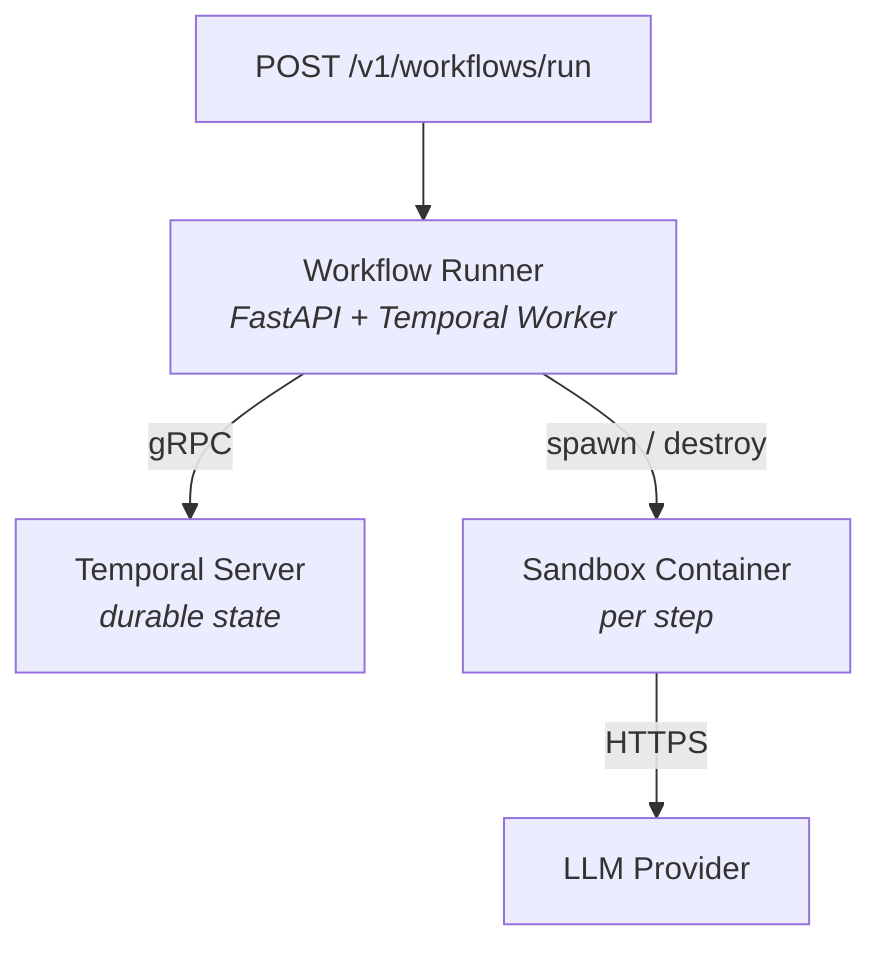

# Lightspeed Cloud Agents

Agent workflow and harness platform. Deploys AI agents as ephemeral sandbox containers in Kubernetes or Podman, powered by Temporal.

## Quick Start

```bash
# Install
uv sync --group dev

# Run tests
uv run pytest tests/unit/ -q

# Start workflow runner (requires Temporal Server at localhost:7233)
uv run uvicorn cloud_agents.workflow.temporal_entrypoint:app --host 0.0.0.0 --port 8080
```

See [docs/DEMO.md](docs/DEMO.md) for full deployment guide with Podman and Kubernetes.

## Architecture

See [docs/ARCHITECTURE.md](docs/ARCHITECTURE.md) for goals, requirements, and design.



## Key Docs

- [ARCHITECTURE.md](docs/ARCHITECTURE.md) — goals, requirements, design, components
- [DEMO.md](docs/DEMO.md) — deployment guide (Podman / Kind / Helm) + workflow definition reference + diagnostic workflow example
- [RBAC](docs/rbac.md) — authorization: policy file format, identity matching, quick start
- [Implementation Plan](docs/gaps/gaps-implementation-plan.md) — all planned work (T1-T36)
