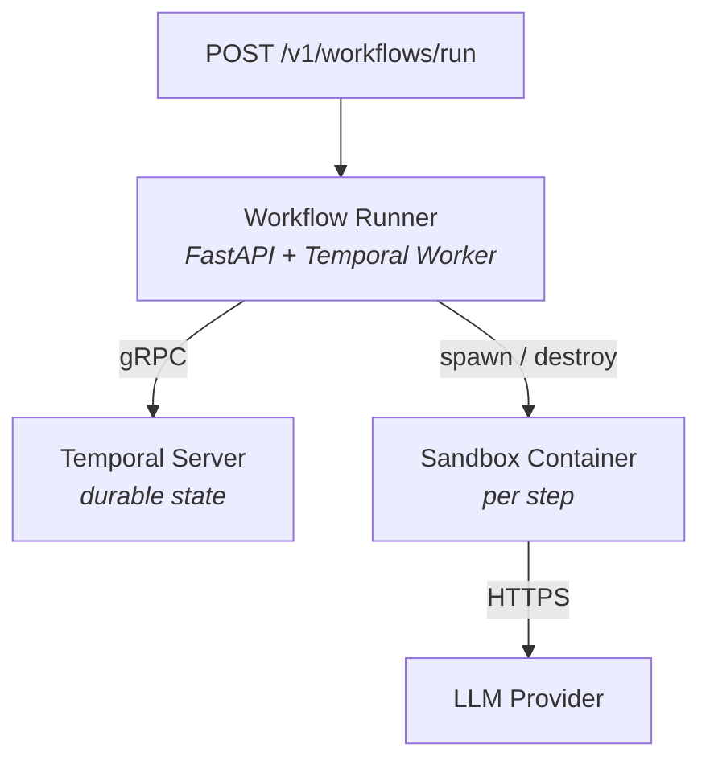

# Lightspeed Cloud Agents

Agent workflow and harness platform. Deploys AI agents as ephemeral sandbox containers in Kubernetes or Podman, powered by Temporal.

## Quick Start

```bash
export OPENAI_API_KEY="sk-..."    # or ANTHROPIC_API_KEY

make build      # build all 3 images (runner, sandbox, MCP server)
make up         # start the platform (Temporal + runner + MCP)
make dashboard  # open demo dashboard at http://localhost:3000/demo-dashboard.html
```

Select a scenario in the dashboard and click Run. See [docs/DEMO.md](docs/DEMO.md) for full deployment guide, API reference, and Kubernetes setup.

## Architecture

See [docs/ARCHITECTURE.md](docs/ARCHITECTURE.md) for goals, requirements, and design.



## Key Docs

- [ARCHITECTURE.md](docs/ARCHITECTURE.md) — goals, requirements, design, components
- [DEMO.md](docs/DEMO.md) — deployment guide (Podman / Kind / Helm) + workflow definition reference + diagnostic workflow example
- [RBAC](docs/rbac.md) — authorization: policy file format, identity matching, quick start
- [Implementation Plan](docs/gaps/gaps-implementation-plan.md) — all planned work (T1-T50)
