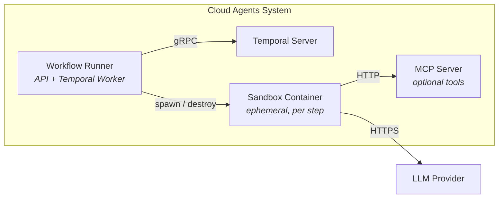

# Lightspeed Cloud Agents

Agent workflow and harness platform. Deploys AI agents as ephemeral sandbox containers in Kubernetes or Podman, powered by Temporal.

## Quick Start

### Prerequisites

- **Podman** with Podman Desktop or `podman machine start`
- **LLM API key** — `OPENAI_API_KEY` or `ANTHROPIC_API_KEY`


### Steps

```bash
export OPENAI_API_KEY="sk-..."    # or ANTHROPIC_API_KEY

make build      # build all 3 images (runner, sandbox, MCP server)
make up         # start the platform (Temporal + runner + MCP)
make dashboard  # open demo dashboard at http://localhost:3000/demo-dashboard.html
```


### What Gets Deployed

Three images, five containers:

| Image | Purpose | Container |
|-------|---------|-----------|
| `workflow-runner` | REST API + Temporal Worker — the brain that interprets workflow YAML and dispatches steps | `podman-workflow-runner-1` |
| `lightspeed-agentic-sandbox` | Agent runtime — each workflow step spawns one of these. Runs a complete agent loop (multi-turn LLM + tool calls) then exits. | `agent-ca-*` (ephemeral) |
| `mcp-filesystem` | MCP tool server — exposes filesystem read/write tools over streamable HTTP. Sandbox containers connect to it for tool calls. | `podman-mcp-filesystem-1` |

Plus two infrastructure containers managed by compose:

| Container | Purpose |
|-----------|---------|
| `podman-temporal-server-1` | Temporal Server — durable workflow state, retry, signals |
| `podman-temporal-db-1` | PostgreSQL — Temporal's storage backend |



## Key Docs

- [ARCHITECTURE.md](docs/ARCHITECTURE.md) — goals, requirements, design, components
- [DEMO.md](docs/DEMO.md) — deployment guide (Podman / Kind / Helm) + workflow definition reference + diagnostic workflow example
- [RBAC](docs/rbac.md) — authorization: policy file format, identity matching, quick start
- [Implementation Plan](docs/gaps/gaps-implementation-plan.md) — all planned work (T1-T50)
