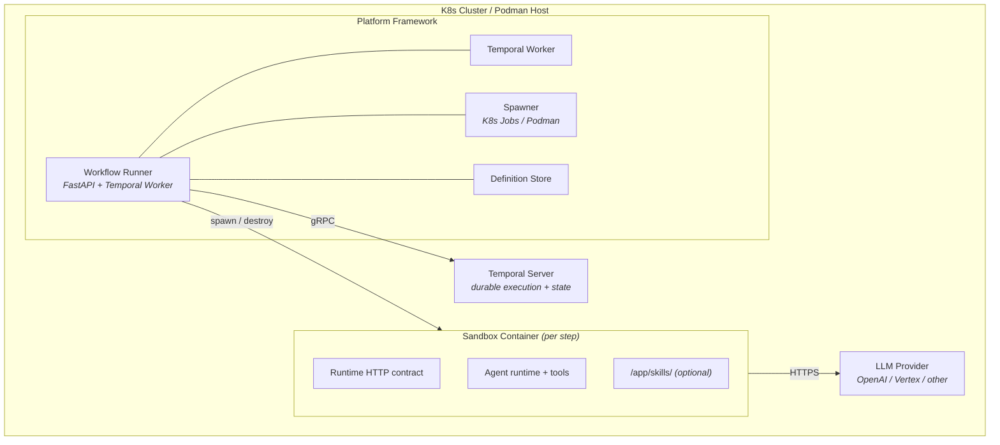

# Cloud Agents Framework

## Overview

The Cloud Agents Framework is an **agent workflow and harness platform**. It enables product teams to define, deploy, and operate AI agents and multi-step workflows as server-side services.

The framework uses **Temporal** for durable workflow execution and isolated runtime containers for step execution. Each workflow step runs in a spawned runtime behind an HTTP contract, which lets compatible runtime images participate in workflow execution without changing the engine.

## Goals

### G1. Bring Your Own Agents & Workflows
Define agents and multi-step agentic workflows via YAML. No forking, no rebuilds, no framework changes. Product teams deploy AI agents without changing framework code.

### G2. Secured & Governed Execution
Each step runs in its own disposable container with scoped permissions, hard timeouts, and no shared state. Human oversight on high-risk operations via approval gates. Full observability: tracing, metrics, event streaming.

### G3. Composable Agent Ecosystem
Agents and workflows are reusable building blocks. A chatbot invokes workflows as tools. Workflows chain agents. Multiple trigger points: conversations, alerts, API, schedules.

### G4. Human Follow-up with Preserved Context
When automation reaches its limit, the framework packages workflow context for review, escalation, and operator follow-up — including handoff to interactive AI CLI sessions.

### G5. Kubernetes and Podman Deployment Targets
The same workflow model runs on both, with deployment-specific security and operational controls.

## Design Principles

### R1. Framework, not pre-built agents [G1]
The framework provides the workflow engine, spawner, and observability. Product teams provide workflow definitions, skills, and MCP server configs.

### R2. Multi-step workflows with human oversight [G1, G2]
Chain agents with conditions, retry, approval gates, escalation. Low-risk steps auto-approve; high-risk steps require human review.

### R3. Ephemeral-by-default [G2]
Each agent step spawns a sandbox container with isolated runtime state, bounded timeouts, and best-effort cleanup with orphan reconciliation. `human-approval` steps do not spawn containers.

### R4. Human-in-the-loop [G2]
Diagnose → Propose → Gate → Execute → Verify. Structured output with risk levels. Approval gates pause workflows for human review.

### R5. Human-out-of-the-loop [G2, G4]
When retries exhaust, escalation packages full context — diagnosis, steps taken, failure history. *(TODO: interactive CLI handoff — see [T15](gaps/gaps-implementation-plan.md#t15-interactive-cli-handoff-r5-r17))*

### R6. Retry with escalation [G2, G4]
Each retry sees full failure history. Exhausted retries route to R4 (approval) or R5 (escalation handoff).

### R7. Stateless runner, durable state [G1, G5]
Workflow state lives in Temporal Server, not in the runner process. Scales horizontally behind a load balancer. Replica crashes don't lose workflows.

## Requirements

| Req | Area | Status | Description |
|-----|------|--------|-------------|
| R8 | Execution engine | Done | Temporal workflow engine + sandbox containers |
| R9 | Runtime | Done | FastAPI + Temporal Worker + sandbox HTTP contract |
| R10 | Deployment | Done | K8s Jobs, Podman containers, Helm chart |
| R11 | Persistence | Done | Temporal Server provides durable execution and state |
| R12 | Security | Partial | Secrets, auth, risk_level, securityContext done. Per-step tool filtering: runner-side forwarding done ([T1](gaps/gaps-implementation-plan.md#t1-forward-permissionscope-to-sandbox-contract)), sandbox-side enforcement pending |
| R13 | Access control | Done | Per-user/team RBAC via pluggable authorizer (Noop / PolicyFile). See [rbac.md](rbac.md) |
| R14 | Observability | Done | OTel tracing, Prometheus metrics, structured logging, health probes, audit events |
| R15 | Triggers | Partial | API, alert ([T13](gaps/gaps-implementation-plan.md#t13-alert-trigger-r15)), and schedule ([T14](gaps/gaps-implementation-plan.md#t14-schedule-trigger-r15)) triggers done. Chatbot ([T12](gaps/gaps-implementation-plan.md#t12-chatbot-trigger-r15)) TODO |
| R16 | Agents-as-tools | TODO | Registry auto-generates LLM tools from workflow definitions ([T11](gaps/gaps-implementation-plan.md#t11-agents-as-tools-r16)) |
| R17 | Escalation | Partial | Context packaging + delivery done. CLI handoff TODO ([T15](gaps/gaps-implementation-plan.md#t15-interactive-cli-handoff-r5-r17)) |

---

## Architecture



### Workflow Runner

The stateless workflow engine. A FastAPI app that embeds a Temporal worker. Receives workflow run requests via REST, starts Temporal workflow executions, and dispatches steps as Temporal activities to sandbox pods. Callers can supply their own `workflow_id` for idempotency; if omitted, a random ID is generated. Duplicate submissions with the same `workflow_id` return `409 Conflict`.

- **Temporal AgentWorkflow** — a single `@workflow.defn` class that interprets any workflow YAML at runtime. Handles conditions, retry, approval signals, and parallel groups. Registered once at worker startup — new workflow definitions don't require worker restarts.
- **Sandbox activities** — `run_sandbox_step` spawns an ephemeral container, calls the runtime HTTP interface, collects the result, and destroys the container. `send_approval_notification` dispatches approval requests to pluggable notifiers. `build_escalation_activity` packages failed workflow context for follow-up.
- **DefinitionStore** — CRUD for workflow definitions with versioning. The current app wiring uses an in-memory store. Shared persistence is an extension point rather than the default runtime behavior.
- **Spawner** — `AgentSpawner` ABC with `KubernetesSpawner` and `PodmanSpawner` implementations. Handles `spawn()` → endpoint URL, `wait_ready()` → readiness polling, `destroy()` → cleanup, and `list_active()` → orphan detection.

### Sandbox Runtime

Each agent step spawns a sandbox container that runs a **complete agent loop** — not a single LLM call. The agent runtime (e.g. OpenAI Agents SDK, Anthropic SDK) drives a multi-turn loop: send prompt + tools to LLM → LLM responds with a tool call → execute tool → feed result back → repeat until the LLM produces a final answer. A single workflow step may involve many LLM round-trips and tool invocations, all happening inside the sandbox container. The workflow runner has no visibility into these turns — it sees one activity call that returns a structured result.

The sandbox is an HTTP service that receives a step request from the workflow engine and returns structured output. Configuration is supplied through environment variables and optional mounted content:

| Configuration | Purpose |
|---------------|---------|
| `LIGHTSPEED_PROVIDER` env var | LLM provider identifier (claude, openai, gemini) |
| `LIGHTSPEED_MODEL` env var | Model name or ID |
| `LIGHTSPEED_MODEL_PROVIDER` env var (optional) | LLM provider type for SDK routing (e.g. azure_openai). Set from workflow `provider.model_provider` or inherited from runner env |
| Credential Secret (via `credentials_secret`) | Provider credentials (K8s Secret volume mount or env var) |
| `LIGHTSPEED_MCP_SERVERS` env var (optional) | MCP server configs with file-reference secret headers |
| `LIGHTSPEED_SERVICE_ACCOUNT` env var (optional) | Kubernetes ServiceAccount name from step `permissions.service_account` |
| Deployment provider env vars (optional) | `LIGHTSPEED_PROVIDER_URL`, `LIGHTSPEED_PROVIDER_PROJECT`, `LIGHTSPEED_PROVIDER_REGION`, `LIGHTSPEED_PROVIDER_API_VERSION` |
| `SANDBOX_TLS_CERT_PATH` / `SANDBOX_TLS_KEY_PATH` env vars (optional) | Paths to ephemeral TLS cert and key injected by the spawner when `SANDBOX_TLS_MODE=app` |
| `AGENT_API_TOKEN` env var (optional) | Runner-to-sandbox bearer auth token. Injected when `SANDBOX_AUTH_ENABLED=true`. Sandbox validates via `BearerAuthMiddleware` |
| `AGENT_EVENT_LOG` env var | Path where the sandbox writes structured JSONL events (`/tmp/agent-events.jsonl`). Activates the EventLogger file sink for transcript collection |
| `/app/skills/` (optional) | Domain knowledge packages from skills OCI image |

The architecture treats the runtime interface generically: the workflow engine sends a prompt plus workflow context and receives structured output. Exact route shapes and runtime adapters are implementation details.

### Temporal Server

Temporal provides durable execution for workflow runs:

- **Workflow state** — step results, approval decisions, and event history are stored as workflow state within Temporal, not in an external database.
- **Retry and timeout** — `RetryPolicy` on each activity controls retry count; `start_to_close_timeout` enforces hard deadlines. Heartbeat-based cancellation detection ensures sandbox cleanup on timeout ([T2](gaps/gaps-implementation-plan.md#t2-explicit-sandbox-termination-on-timeoutcancellation)).
- **Approval signals** — human approval is implemented as a Temporal signal (`AgentWorkflow.approve`), with `wait_condition` blocking until the signal arrives or times out.
- **Parallel execution** — steps sharing a `parallel_group` are dispatched via `asyncio.gather` within the workflow.
- **Crash recovery** — content-hash pod naming for idempotent retries + startup orphan reconciliation for leaked containers.

### Dual Deployment

| Capability | Kubernetes | Podman |
|-----------|-----------|--------|
| Ephemeral spawning | K8s Jobs + Services | Podman containers + port mapping |
| Networking | K8s Services + ClusterIP DNS | Podman network + container DNS |
| RBAC | ServiceAccounts + RoleBindings | OS-level access control |
| NetworkPolicy | Enforced by CNI (enabled by default) | Host firewall rules ([docs](DEPLOYMENT.md#podman)) |
| Durable execution | Temporal deployment | Temporal deployment |
| Config distribution | Env vars + K8s Secrets | Env vars |

The spawner abstraction (`AgentSpawner`) keeps workflow behavior consistent while allowing deployment-specific controls.

### Security

**Implemented:**
- **TLS for Temporal gRPC** — optional mutual TLS via environment variables
- **securityContext on pods** — non-root, read-only root filesystem, no privilege escalation
- **K8s Secrets** — provider and MCP credentials injected through explicit secret references and volume mounts
- **Explicit risk_level** — missing `risk_level` defaults to manual approval
- **Bearer auth** — configurable auth dependency; fails closed when `AUTH_REQUIRED=true`
- **Audit trail** — `emit_audit()` logs workflow lifecycle, approval decisions, sandbox spawn/destroy, secret mounts, escalation, orphan cleanup
- **Concurrency cap** — `MAX_SPAWNED_PODS` prevents resource exhaustion
- **MCP secret allowlist** — `MCP_ALLOWED_SECRETS` restricts which secrets can be mounted; file-reference headers keep secrets out of env vars
- **Resource limits** — `SpawnConfig` enforces CPU (max 4 cores) and memory (max 4Gi) bounds with Pydantic validators
- **Network egress enforcement** — NetworkPolicy restricts sandbox egress to DNS and explicitly configured LLM provider CIDRs (`llmCidrs`). Enabled by default in Helm. Podman deployments use host firewall rules. See [DEPLOYMENT.md](DEPLOYMENT.md#network-egress-policy).
- **Per-user rate limiting** — token bucket middleware (`RATE_LIMIT_ENABLED`) with sha256-hashed bearer token keys, 429 + Retry-After header, Prometheus counter. Health/metrics endpoints exempt.
- **App-level TLS** — ephemeral self-signed CA + per-sandbox certs generated at spawn time (`SANDBOX_TLS_MODE=app`). K8s: cert Secret mount. Podman: temp dir bind mount. Service mesh deployments (`SANDBOX_TLS_MODE=mesh`) skip app-level TLS.
- **Sandbox heartbeat + timeout** — `activity.heartbeat()` during sandbox HTTP calls with 180s timeout. Cancellation detected via `asyncio.CancelledError`, ensures `destroy()` runs. `ls_sandbox_timeout_total` metric.

**Partial** (see [implementation plan](gaps/gaps-implementation-plan.md)):
- Per-step tool filtering ([T1](gaps/gaps-implementation-plan.md#t1-forward-permissionscope-to-sandbox-contract)) — runner-side forwarding of `allowedTools`/`deniedTools` to the sandbox POST body is done. Sandbox-side enforcement is pending (separate repo: lightspeed-agentic-sandbox).
- Advisory mode tool filtering (blocked on T1 sandbox-side)

**TODO**:
- Dynamic RBAC from agent output ([T9](gaps/gaps-implementation-plan.md#t9-dynamic-rbac-from-agent-output))

### Authorization (RBAC)

Pluggable authorization controls who can trigger, approve, view, and cancel workflows. Every API endpoint is authorized after authentication.

- **CallerIdentity** — extracted from auth middleware (K8s ServiceAccount token → username/uid/groups, shared secret → anonymous)
- **PolicyFileAuthorizer** — YAML policy rules with identity matching (user/team/sa/anonymous), workflow glob patterns, owner-scoped conditions, and configurable defaults
- **NoopAuthorizer** — default, backward-compatible, all actions allowed
- **WorkflowAuthzContext** — owner identity captured at trigger time, persisted in Temporal state, used for later approve/view/cancel authorization
- **ApproverInfo** — approver identity recorded in workflow state, queryable via status API
- **Fail-closed** — missing identity with authz enabled → 401; no matching rule → 403; context lookup failure → 503

See [rbac.md](rbac.md) for full documentation including policy file format and quick start guide.

**RBAC TODO:**
- Risk-level scoped approval — `conditions.risk_levels` in policy rules (requires querying step risk during authorization)
- K8s SubjectAccessReview backend — delegates to K8s RBAC (requires resource model design)

### Triggers

Workflows can be started from multiple entry points:

- **API trigger** — `POST /v1/workflows/run` with embedded or stored definition. Primary trigger for programmatic and UI-driven workflows.
- **Alert trigger** — `POST /v1/webhooks/alertmanager` accepts Alertmanager webhook payloads and maps alerts to workflow definitions. Configurable via `ALERT_TRIGGER_ENABLED`, `ALERT_TRIGGER_DEFAULT_WORKFLOW`. Includes dedup, RBAC enforcement, content policy validation, and prompt sanitization.
- **Schedule trigger** — `POST /v1/schedules` CRUD endpoints backed by Temporal's native Schedules API. Supports standard 5-field cron and shorthands (`@daily`, `@hourly`, `@every 5m`). Configurable via `SCHEDULE_TRIGGER_ENABLED`.
- **Chatbot trigger** — TODO ([T12](gaps/gaps-implementation-plan.md#t12-chatbot-trigger-r15))

### Observability

- **OpenTelemetry** — distributed traces across workflow runner → Temporal → sandbox pods → LLM; Temporal `TracingInterceptor` propagates spans across workflow/activity boundaries
- **Prometheus** — per-run and per-step metrics (`ls_workflow_runs_total`, `ls_workflow_step_runs_total`); `/metrics` endpoint on the workflow runner
- **Structured logging** — JSON-formatted logs via `python-json-logger` with workflow/step correlation; toggled via `LOG_FORMAT` env var
- **Health probes** — `/healthz`, `/livez`, `/readyz` (readyz returns 503 when Temporal is unreachable)

## Workflow Definition

```yaml
apiVersion: v1
kind: AgentWorkflow
metadata:
  name: diagnose-and-fix
spec:
  steps:
    - name: diagnose
      type: agent
      prompt: "Check all hosts for issues."
      output_key: diagnosis
      output_schema:
        type: object
        properties:
          summary: { type: string }
          issues_found: { type: integer }
        required: [summary, issues_found]

    - name: approve
      type: human-approval
      message: "Review diagnosis and approve remediation."
      output_key: approval
      risk_level: high

    - name: fix
      type: agent
      prompt: "Fix issues found: {{ steps.diagnosis.output.summary }}"
      output_key: fix
      condition: "steps.approval.output.approved == true"
      timeout_seconds: 120

    - name: verify
      type: agent
      prompt: "Verify the cluster is healthy."
      output_key: verification
```

## Structured Output

Agents return structured output defined by `output_schema` in the workflow step. The schema is agent-defined rather than framework-fixed — custom output types are supplied per step.

## Retry with Context

Failed steps retry with full failure history. Each attempt sees what was tried before and why it failed. Temporal's `RetryPolicy` controls the retry count, and the activity timeout enforces hard deadlines per attempt. After exhausting retries, the framework generates an **escalation handoff** — delivered via configurable channels (log, webhook). *(TODO: interactive CLI handoff — see [T15](gaps/gaps-implementation-plan.md#t15-interactive-cli-handoff-r5-r17))*

## Phase History

| Phase | Focus | Status |
|-------|-------|--------|
| PoC1 1a | Diagnostic agent in container, cross-pod HTTP | Done |
| PoC1 1b | Monitoring agent, async runs, observability | Done |
| PoC1 2 | Generic agent runtime template image | Done (removed — replaced by sandbox) |
| PoC1 3 | Workflow executor with approval gates | Done (removed — replaced by Temporal) |
| PoC1 4a-c | Auth, persistence, OTel, advisory mode | Done (removed — replaced by Temporal) |
| PoC1 5-7 | Stateless runner, security hardening | Done (removed — replaced by Temporal) |
| PoC2-1 | Temporal engine + sandbox activities | Done |
| PoC2-2 | Policy layer (auto-approve, advisory, permissions) | Done |
| PoC2-3 | Productization (Containerfile, OTel, Helm, CI, TLS) | Done |
| Prod | Credential mounts, MCP injection, securityContext, audit, graceful shutdown | Done |
