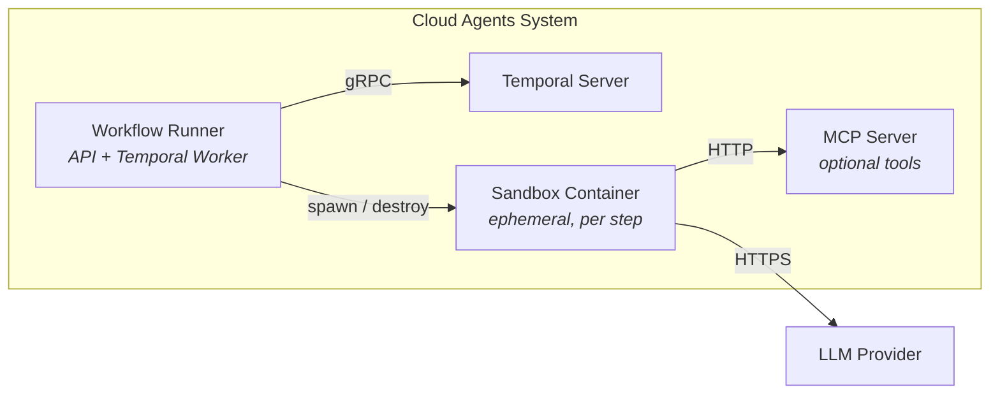

# Cloud Agents — Deployment & Demo

For quick start, see [README.md](../README.md#quick-start).

## What Gets Deployed

Three images, five containers:

| Image | Purpose | Container |
|-------|---------|-----------|
| `workflow-runner` | REST API + Temporal Worker — the brain that interprets workflow YAML and dispatches steps | `podman-workflow-runner-1` |
| `lightspeed-agentic-sandbox` | Agent runtime — each workflow step spawns one of these. Runs a complete agent loop (multi-turn LLM + tool calls) then exits. | `agent-ca-*` (ephemeral) |
| `mcp-filesystem` | MCP tool server — exposes filesystem read/write tools over streamable HTTP. Sandbox containers connect to it for tool calls. | `podman-mcp-filesystem-1` |

Plus two infrastructure containers managed by compose:

| Container | Purpose |
|-----------|---------|
| `podman-temporal-server-1` | Temporal Server — durable workflow state, retry, signals |
| `podman-temporal-db-1` | PostgreSQL — Temporal's storage backend |



## Building Images

```bash
make build          # builds all 3 images
make build-runner   # just the workflow runner
make build-sandbox  # just the sandbox (clones fork if needed)
make build-mcp      # just the MCP filesystem server
```

The sandbox image must be built from our fork (`jameswnl/lightspeed-agentic-sandbox`, branch `temporal-integration`) which has MCP streamable HTTP support. `make build-sandbox` handles cloning and checkout automatically.

---

## Deploying the Platform

### Option A: Podman (compose)

```bash
export OPENAI_API_KEY="sk-..."

make up      # starts all containers
make status  # show what's running
make down    # stop everything
```

| Service | URL |
|---------|-----|
| Workflow Runner API | http://localhost:8080 |
| Temporal UI | http://localhost:8233 |
| MCP Filesystem Server | http://localhost:8081 |

### Option B: Kubernetes (Kind)

```bash
KIND_EXPERIMENTAL_PROVIDER=podman kind create cluster --name cloud-agents --wait 60s

kind load docker-image workflow-runner:latest --name cloud-agents
kind load docker-image lightspeed-agentic-sandbox:latest --name cloud-agents

kubectl apply -f deploy/kind/temporal.yaml
kubectl wait --for=condition=ready pod -l app=temporal-server --timeout=120s

kubectl create secret generic llm-api-key \
  --from-literal=OPENAI_API_KEY="$OPENAI_API_KEY"

kubectl apply -f deploy/kind/rbac.yaml
kubectl apply -f deploy/kind/workflow-runner.yaml
kubectl wait --for=condition=ready pod -l app=workflow-runner --timeout=60s

kubectl port-forward svc/workflow-runner 8080:8080 &
curl -s http://localhost:8080/readyz
```

### Option C: Helm (production)

```bash
helm install cloud-agents deploy/helm/cloud-agents-temporal/ \
  --set workflowRunner.image.repository=quay.io/openshift-lightspeed/workflow-runner \
  --set workflowRunner.image.tag=latest \
  --set temporal.url=temporal-server:7233 \
  --set spawner.type=kubernetes
```

---

## Demo Recording

See [examples/cloud-agents-demo-1.mov](../examples/cloud-agents-demo-1.mov) for a recorded walkthrough of the K8s Incident Response scenario (diagnose → approve → fix → verify).

## Part 3: Demo Dashboard

The interactive dashboard visualizes workflow execution in real-time.

```bash
# Serve the dashboard
cd docs && python3 -m http.server 3000 &

# Open http://localhost:3000/demo-dashboard.html
```

### Scenarios

| Scenario | Type | Description |
|----------|------|-------------|
| K8s Incident Response | Live | diagnose → approve → fix → verify with real LLM calls |
| MCP Tool Integration | Live | Agent reads files via filesystem MCP server tools |
| Multi-workflow Composition | Animated | Chatbot triggers chained workflows (future vision) |
| Security & Governance | Live | Audit → approve (critical) → remediate |

### Terminal setup for demo

**Terminal 1** — Dashboard: `cd docs && python3 -m http.server 3000`

**Terminal 2** — Sandbox logs: 
```bash
while true; do
  for c in $(podman ps --filter label=spawned-by=workflow-runner --format '{{.Names}}' 2>/dev/null); do
    echo "=== $c ==="
    podman logs -f "$c" 2>&1 &
  done
  sleep 1
done
```

**Terminal 3** — Container lifecycle: `watch -n1 podman ps --filter label=spawned-by=workflow-runner`

---

## Part 4: API Reference

### Submit a workflow

```bash
curl -s -X POST http://localhost:8080/v1/workflows/run \
  -H 'Content-Type: application/json' \
  -d '{
    "definition": {
      "apiVersion": "v1",
      "kind": "AgentWorkflow",
      "metadata": { "name": "diagnose-production" },
      "spec": { "steps": [...] }
    },
    "provider": {
      "name": "openai",
      "model": "gpt-4o",
      "credentials_secret": "OPENAI_API_KEY"
    },
    "sandbox_image": "lightspeed-agentic-sandbox:latest"
  }'
# → {"workflow_id": "wf-abc123"}
```

Or register a definition first:

```bash
# Register
python3 -c "import yaml,json,sys; print(json.dumps(yaml.safe_load(open(sys.argv[1]))))" \
  examples/definitions/diagnostic-workflow.yaml | \
  curl -s -X POST http://localhost:8080/v1/workflows/definitions \
    -H 'Content-Type: application/json' -d @-

# Trigger by name
curl -s -X POST http://localhost:8080/v1/workflows/run \
  -H 'Content-Type: application/json' \
  -d '{"workflow_name": "diagnose-production", "provider": {...}, "sandbox_image": "..."}'
```

### Check status

```bash
curl -s http://localhost:8080/v1/workflows/<workflow_id> | python3 -m json.tool
```

### Approve a step

```bash
curl -s -X POST http://localhost:8080/v1/workflows/<workflow_id>/approve \
  -H 'Content-Type: application/json' \
  -d '{"step_name": "approve-fix", "decision": "approved"}'
```

### Stream events (SSE)

```bash
curl -N http://localhost:8080/v1/workflows/<workflow_id>/events
```

### Cancel

```bash
curl -s -X POST http://localhost:8080/v1/workflows/<workflow_id>/cancel
```

---

## Workflow Definition Reference

### Step types

| Type | Purpose |
|------|---------|
| `agent` | Spawns a sandbox container running a complete agent loop (multi-turn LLM + tool calls) |
| `human-approval` | Pauses workflow, sends notification, waits for approval signal or timeout |

### Step fields

| Field | Required | Description |
|-------|----------|-------------|
| `name` | Yes | Unique step identifier |
| `type` | Yes | `agent` or `human-approval` |
| `output_key` | Yes | Key for this step's result in workflow state |
| `prompt` | For agent | Prompt template (supports `{{ steps.X.output.Y }}` interpolation) |
| `output_schema` | No | JSON Schema for structured output (arrays require `items`) |
| `timeout_seconds` | No | Max seconds for this step (default: 600 for agent, 86400 for approval) |
| `condition` | No | Skip step if expression evaluates to false |
| `risk_level` | No | `low`, `medium`, `high`, `critical` — used by auto-approve policy |
| `message` | For approval | Human-readable approval request message |
| `max_retries` | No | Number of retry attempts (default: 1) |
| `parallel_group` | No | Steps sharing the same group run concurrently |
| `mcp_servers` | No | List of MCP server names (from run request catalog) to inject into this step |

### API request fields

The workflow YAML defines *what* (steps, prompts, schemas). The API request provides *how*:

| Field | Description |
|-------|-------------|
| `provider` | `{name, model, credentials_secret}` — LLM provider config |
| `sandbox_image` | Container image for agent steps |
| `skills_image` / `skills_paths` | Optional skills OCI image |
| `mcp_servers` | MCP server catalog — `[{name, url, headers}]`. Steps reference by name. |
| `approval_policy` | `{auto_approve_risk_levels: ["low"]}` |
| `workflow_id` | Optional caller-supplied idempotency key |

### Example definitions

See `examples/definitions/` for working workflow YAMLs:
- `diagnostic-workflow.yaml` — diagnose + approve
- `diagnose-fix-workflow.yaml` — diagnose → approve → fix → verify
- `mcp-filesystem-workflow.yaml` — gather context via MCP tools → recommend
- `security-audit-workflow.yaml` — audit → approve (critical) → remediate
- `ephemeral-diagnose-workflow.yaml` — single diagnostic step

These are validated by CI against the Pydantic schema.

---

## Cleanup

### Podman
```bash
podman compose -f deploy/podman/docker-compose.temporal.yaml down
```

### Kubernetes
```bash
KIND_EXPERIMENTAL_PROVIDER=podman kind delete cluster --name cloud-agents
```

## Running tests

```bash
# Unit tests
uv run pytest tests/unit/ -q

# Integration tests (requires Temporal)
uv run pytest tests/integration/ -v
```
