# Cloud Agents Architecture — with OpenShell Integration

## Current Architecture (Direct Spawner)

```mermaid
graph TD
    subgraph cluster["K8s Cluster / Podman Host"]
        subgraph platform["Platform Framework"]
            WR["Workflow Runner<br/><i>FastAPI + Temporal Worker</i>"]
            WR --- TW["Temporal Worker"]
            WR --- SP["Spawner ABC<br/><i>KubernetesSpawner / PodmanSpawner</i>"]
            WR --- DS["Definition Store"]
            WR --- TS_STORE["Transcript Store<br/><i>PostgreSQL</i>"]
        end

        subgraph sandbox["Sandbox Container <i>(per step)</i>"]
            RT["POST /v1/agent/run"]
            EV["GET /v1/agent/events"]
            AG["Agent runtime + tools"]
            MCP_C["MCP client connections"]
        end

        TS["Temporal Server"]
        PG["PostgreSQL<br/><i>Temporal state + transcripts</i>"]
        MCP_S["MCP Servers<br/><i>kubectl / RHDH / filesystem</i>"]
        LLM["LLM Provider<br/><i>OpenAI / Vertex / Anthropic</i>"]
    end

    WR -- "spawn / destroy" --> sandbox
    WR -- "POST /v1/agent/run" --> RT
    WR -- "GET /v1/agent/events" --> EV
    WR -- "gRPC" --> TS
    WR -- "SQL" --> PG
    TS -- "state" --> PG
    sandbox -- "MCP tools" --> MCP_S
    sandbox -- "HTTPS" --> LLM

    style SP fill:#2d333b,stroke:#58a6ff
    style sandbox fill:#161b22,stroke:#238636
```



## OpenShell Architecture (Secured Spawner)

```mermaid
graph TD
    subgraph cluster["K8s Cluster / Podman Host"]
        subgraph platform["Platform Framework"]
            WR["Workflow Runner<br/><i>FastAPI + Temporal Worker</i>"]
            WR --- TW["Temporal Worker"]
            WR --- OSS["OpenShellSpawner<br/><i>gRPC client</i>"]
            WR --- DS["Definition Store"]
            WR --- TS_STORE["Transcript Store<br/><i>PostgreSQL</i>"]
        end

        subgraph openshell["OpenShell Gateway"]
            GW["Gateway Service<br/><i>gRPC + REST</i>"]
            GW --- DRIVER["Compute Driver<br/><i>K8s CRD / Podman / Docker</i>"]
            GW --- POLICY["Policy Engine<br/><i>OPA-based L4/L7</i>"]
            GW --- JWT["JWT Issuer<br/><i>per-sandbox tokens</i>"]
            GW --- CREDS["Credential Providers"]
        end

        subgraph sandbox["OpenShell Sandbox <i>(per step)</i>"]
            SUP["Supervisor Binary<br/><i>Landlock + seccomp + netns</i>"]
            SUP --- RT["POST /v1/agent/run"]
            SUP --- EV["GET /v1/agent/events"]
            SUP --- AG["Agent runtime + tools"]
            SUP --- MCP_C["MCP client connections"]
        end

        TS["Temporal Server"]
        PG["PostgreSQL<br/><i>Temporal state + transcripts</i>"]
        MCP_S["MCP Servers<br/><i>kubectl / RHDH / filesystem</i>"]
        LLM["LLM Provider<br/><i>OpenAI / Vertex / Anthropic</i>"]
    end

    WR -- "gRPC: CreateSandbox /<br/>ExecSandbox / DeleteSandbox" --> GW
    GW -- "spawn + inject supervisor" --> sandbox
    GW -- "JWT token" --> SUP
    WR -- "ExposeService → HTTP" --> RT
    WR -- "ExposeService → HTTP" --> EV
    WR -- "gRPC" --> TS
    WR -- "SQL" --> PG
    TS -- "state" --> PG
    sandbox -- "MCP tools<br/>(policy filtered)" --> MCP_S
    sandbox -- "HTTPS<br/>(egress policy)" --> LLM

    style OSS fill:#2d333b,stroke:#a371f7
    style openshell fill:#1c2128,stroke:#a371f7
    style SUP fill:#2d333b,stroke:#f85149
    style sandbox fill:#161b22,stroke:#238636
```



## Comparison

```
Current Path:                    OpenShell Path:
                                
Runner                          Runner
  │                               │
  │ spawn()                       │ gRPC: CreateSandbox
  ▼                               ▼
K8s Job / Podman container      OpenShell Gateway
  │                               │
  │ (no isolation beyond          │ Compute Driver (K8s/Podman/Docker)
  │  container securityContext)   │
  │                               ▼
  │                             Supervisor injected
  │                               │ Landlock (filesystem)
  │                               │ seccomp (syscalls)  
  │                               │ Network namespace (L4/L7 policy)
  │                               │ JWT auth (per-sandbox)
  ▼                               ▼
Sandbox Container               Sandbox Container (hardened)
  POST /v1/agent/run              POST /v1/agent/run  (same contract)
  GET /v1/agent/events            GET /v1/agent/events (same contract)
```

## Key Differences

| Aspect | Direct Spawner | OpenShell |
|--------|---------------|-----------|
| **Container creation** | K8s API / Podman API directly | Gateway abstracts runtime |
| **Sandbox isolation** | Container securityContext | Landlock + seccomp + network namespace |
| **Network policy** | Manual NetworkPolicy YAML | OPA-based L4/L7 with hot-reload |
| **SSRF protection** | None | Built-in internal IP blocking |
| **Credentials** | K8s Secrets / env vars | Gateway-managed providers |
| **Auth per sandbox** | Optional bearer token | Mandatory JWT per sandbox |
| **Multi-runtime** | Separate spawner per runtime | One spawner, gateway handles runtime |
| **Agent contract** | POST /v1/agent/run | POST /v1/agent/run (unchanged) |
| **Transcript collection** | GET /v1/agent/events | GET /v1/agent/events (unchanged) |
| **Infrastructure** | None extra | Gateway service + SQLite/Postgres |

## Deployment Topologies

### Podman (RHEL production)

```
RHEL Host
├── Temporal Server         (container)
├── PostgreSQL              (container)
├── Workflow Runner          (container)
├── OpenShell Gateway        (container, Podman driver)
│   └── Podman socket mount (DooD)
├── MCP Servers              (containers)
└── Sandbox containers       (spawned by Gateway via Podman)
```

### Kubernetes (production)

```
K8s Cluster
├── Temporal Server          (Deployment)
├── PostgreSQL               (StatefulSet)
├── Workflow Runner           (Deployment)
├── OpenShell Gateway         (Deployment, K8s driver)
│   └── Sandbox CRD controller
├── MCP Servers               (Deployments)
└── Sandbox pods              (created as Sandbox CRs)
```
