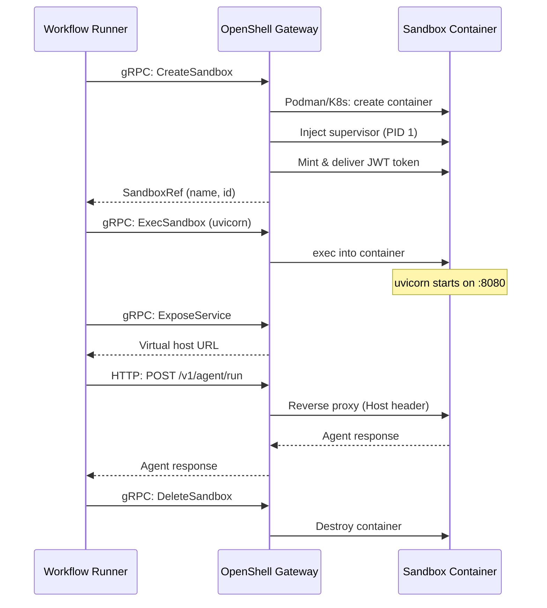
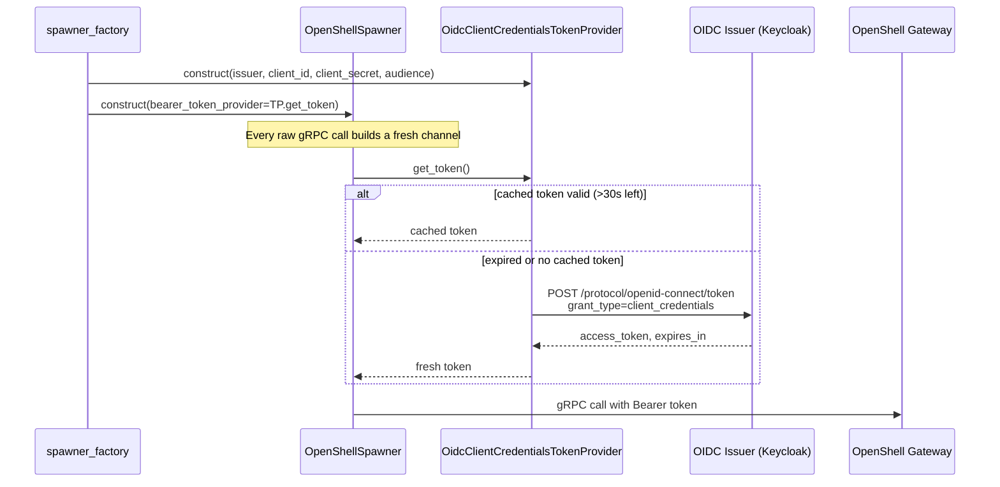

# OpenShell Integration for Cloud Agents

This guide covers the architecture, setup, and operation of the OpenShell gateway with Cloud Agents. OpenShell provides hardened sandbox isolation (Landlock, seccomp, network namespaces) on top of the standard container runtime, replacing direct spawner access with a gateway-mediated architecture.

## Architecture

### Component Architecture

> **`OpenShellSpawner` is the only ephemeral spawner.** Earlier versions of
> `cloud_agents` also supported spawning containers directly against the
> Podman/Kubernetes APIs, bypassing the gateway. That path was removed
> entirely in issue [#198](https://github.com/jameswnl/lightspeed-cloud-agents/issues/198)
> (PR #223) -- `build_spawner()` only accepts `"openshell"` as a
> `spawner_type` today; anything else raises `ValueError`. The diagram and
> comparison below describe OpenShell's own architecture and what it
> provides, not a still-available choice between it and something else.


```mermaid
graph TD
    subgraph cluster["K8s Cluster / Podman Host"]
        subgraph platform["Platform Framework"]
            WR["Workflow Runner<br/><i>FastAPI + Temporal Worker</i>"]
            WR --- TW["Temporal Worker"]
            WR --- OSS["OpenShellSpawner<br/><i>gRPC client</i>"]
            WR --- DS["Definition Store"]
            WR --- TS_STORE["Transcript Store<br/><i>PostgreSQL</i>"]
        end

        subgraph openshell["OpenShell Gateway"]
            GW["Gateway Service<br/><i>gRPC + REST</i>"]
            GW --- DRIVER["Compute Driver<br/><i>K8s CRD / Podman / Docker</i>"]
            GW --- POLICY["Policy Engine<br/><i>OPA-based L4/L7</i>"]
            GW --- JWT["JWT Issuer<br/><i>per-sandbox tokens</i>"]
            GW --- CREDS["Credential Providers"]
        end

        subgraph sandbox["OpenShell Sandbox <i>(per step)</i>"]
            SUP["Supervisor Binary<br/><i>Landlock + seccomp + netns</i>"]
            SUP --- RT["POST /v1/agent/run"]
            SUP --- EV["GET /v1/agent/events"]
            SUP --- AG["Agent runtime + tools"]
            SUP --- MCP_C["MCP client connections"]
        end

        TS["Temporal Server"]
        PG["PostgreSQL<br/><i>Temporal state + transcripts</i>"]
        MCP_S["MCP Servers<br/><i>kubectl / RHDH / filesystem</i>"]
        LLM["LLM Provider<br/><i>OpenAI / Vertex / Anthropic</i>"]
    end

    WR -- "gRPC: CreateSandbox /<br/>ExecSandbox / DeleteSandbox" --> GW
    GW -- "spawn + inject supervisor" --> sandbox
    GW -- "JWT token" --> SUP
    WR -- "ExposeService → HTTP" --> RT
    WR -- "ExposeService → HTTP" --> EV
    WR -- "gRPC" --> TS
    WR -- "SQL" --> PG
    TS -- "state" --> PG
    sandbox -- "MCP tools<br/>(policy filtered)" --> MCP_S
    sandbox -- "HTTPS<br/>(egress policy)" --> LLM

    style OSS fill:#2d333b,stroke:#a371f7
    style openshell fill:#1c2128,stroke:#a371f7
    style SUP fill:#2d333b,stroke:#f85149
    style sandbox fill:#161b22,stroke:#238636
```

### What OpenShell Provides

For context, this is what direct Podman/K8s API access (removed in #198)
lacked, and what routing everything through the gateway buys instead:

| Aspect | Without OpenShell (pre-#198, removed) | OpenShell (current, only option) |
|--------|---------------|-----------|
| **Container creation** | K8s API / Podman API directly | Gateway abstracts runtime |
| **Sandbox isolation** | Container securityContext | Landlock + seccomp + network namespace |
| **Network policy** | Manual NetworkPolicy YAML | OPA-based L4/L7 with hot-reload |
| **SSRF protection** | None | Built-in internal IP blocking |
| **Credentials** | K8s Secrets / env vars | Gateway-managed providers |
| **Auth per sandbox** | Optional bearer token | Mandatory JWT per sandbox |
| **Multi-runtime** | Separate spawner per runtime | One spawner, gateway handles runtime |
| **Agent contract** | POST /v1/agent/run | POST /v1/agent/run (unchanged) |
| **Transcript collection** | GET /v1/agent/events | GET /v1/agent/events (unchanged) |
| **Extra infrastructure** | None | Gateway service + SQLite/Postgres |

### Deployment Topologies

**Podman (RHEL production)**:


```mermaid
graph TD
    subgraph host["RHEL Host"]
        TS["Temporal Server<br/><i>container</i>"]
        PG["PostgreSQL<br/><i>container</i>"]
        WR["Workflow Runner<br/><i>container</i>"]
        GW["OpenShell Gateway<br/><i>container, Podman driver</i>"]
        GW -.- SOCK["Podman socket mount<br/><i>DooD</i>"]
        MCP["MCP Servers<br/><i>containers</i>"]
        SB["Sandbox containers<br/><i>spawned by Gateway</i>"]
    end

    WR --> TS
    WR --> PG
    WR --> GW
    GW --> SB
    SB --> MCP

    style GW fill:#1c2128,stroke:#a371f7
    style SB fill:#161b22,stroke:#238636
```

**Kubernetes (production)**:


```mermaid
graph TD
    subgraph cluster["K8s Cluster"]
        TS["Temporal Server<br/><i>Deployment</i>"]
        PG["PostgreSQL<br/><i>StatefulSet</i>"]
        WR["Workflow Runner<br/><i>Deployment</i>"]
        GW["OpenShell Gateway<br/><i>Deployment, K8s driver</i>"]
        GW -.- CRD["Sandbox CRD controller"]
        MCP["MCP Servers<br/><i>Deployments</i>"]
        SB["Sandbox pods<br/><i>created as Sandbox CRs</i>"]
    end

    WR --> TS
    WR --> PG
    WR --> GW
    GW --> SB
    SB --> MCP

    style GW fill:#1c2128,stroke:#a371f7
    style SB fill:#161b22,stroke:#238636
```

### Local Development: Kind vs Podman

Two local dev topologies are in real use. Both point `OpenShellSpawner` at
an already-deployed gateway -- the client-side config is what differs, not
the spawner's behavior.

| | **Podman** | **Kind** |
|---|---|---|
| Gateway deployment | `podman run` directly on the dev machine (see [Gateway Setup](#gateway-setup) below) | Gateway runs *inside* the cluster as a K8s workload (e.g. a StatefulSet); not covered by this doc -- deploying the gateway onto a cluster is a separate concern from configuring a client to reach one |
| Reaching the gateway | Direct: gateway listens on a host port (`17670` in the examples above) | Indirect: `kubectl port-forward svc/<gateway-service> <local-port>:<gateway-port>` -- the gateway's in-cluster port is never directly reachable from the host |
| TLS | `--disable-tls` + `allow_unauthenticated_users` for dev (see [Gateway Setup](#gateway-setup)) | Same -- plaintext gRPC over the port-forward is typical for a local Kind gateway with no external exposure |
| Compute driver | `podman` (gateway execs into containers via the mounted Podman socket) | `kubernetes` (gateway creates Sandbox CRs / pods in-cluster) |
| Sandbox image architecture | Matches the dev machine's native arch (e.g. `arm64` on Apple Silicon) | **Must be multi-arch** if the Kind cluster's nodes don't match the image-build machine's arch (common in CI or on a shared cluster) -- see the callout below |


```mermaid
graph TD
    subgraph host["Dev Machine"]
        WR["Workflow Runner<br/><i>local process</i>"]
        subgraph podman_case["Podman case"]
            GW_P["OpenShell Gateway<br/><i>podman run, host port 17670</i>"]
            SOCK["Podman socket"]
            GW_P -.- SOCK
        end
        PF["kubectl port-forward<br/><i>local-port:gateway-port</i>"]
    end
    subgraph kind["Kind cluster (Kind case)"]
        GW_K["OpenShell Gateway<br/><i>in-cluster Service</i>"]
        SB_K["Sandbox pods"]
        GW_K --> SB_K
    end

    WR -- "gRPC: localhost:17670" --> GW_P
    WR -- "gRPC: localhost:<local-port>" --> PF
    PF -- "tunneled" --> GW_K

    style GW_P fill:#1c2128,stroke:#a371f7
    style GW_K fill:#1c2128,stroke:#a371f7
```

Client config is otherwise identical between the two -- only
`OPENSHELL_GATEWAY_URL` changes (a host port for Podman, the
port-forwarded local port for Kind):

```bash
# Podman
export OPENSHELL_GATEWAY_URL=localhost:17670
export OPENSHELL_ALLOW_INSECURE_CREDENTIALS=1   # no TLS in dev

# Kind (after `kubectl port-forward svc/openshell-gateway 9090:17670 &`)
export OPENSHELL_GATEWAY_URL=localhost:9090
export OPENSHELL_ALLOW_INSECURE_CREDENTIALS=1   # no TLS in dev
```

> **`OPENSHELL_ALLOW_INSECURE_CREDENTIALS`**: `_create_provider()` fails
> closed by default -- it refuses to send LLM credentials over a plaintext
> channel (issue #199 review) unless `OPENSHELL_TLS_CA` is set. Since a
> local dev gateway (either topology) typically runs without TLS, this env
> var is the explicit opt-in to accept that tradeoff locally. It has no
> effect if `OPENSHELL_TLS_CA` is set -- TLS is used whenever configured,
> regardless of this flag.

> **Gotcha: the `openshell` CLI manages its own tunnel, separate from any
> port-forward you start.** Running `openshell gateway add --driver
> kubernetes ...` against a Kind cluster has the CLI set up (and cache) its
> *own* connection, independent of any `kubectl port-forward` you run
> yourself. These are two unrelated tunnels to the same underlying gateway
> Service, often on different local ports. `OpenShellSpawner`'s raw gRPC
> client (used by `cloud_agents`, not the CLI) only ever talks to whatever
> `OPENSHELL_GATEWAY_URL` points at -- it does not discover or reuse the
> CLI's tunnel. If `openshell gateway info` reports a different port than
> the one you're port-forwarding, that's expected, not a bug; just make
> sure `OPENSHELL_GATEWAY_URL` matches your own port-forward, not whatever
> the CLI prints.

> **Gotcha: single-arch sandbox images hang, not fail, on the wrong
> architecture.** A sandbox image built and pushed from an Apple Silicon
> Mac (`arm64`) works fine against a local Kind cluster on that same Mac,
> but gets stuck in `Provisioning` indefinitely -- no clear error, just a
> timeout -- when the same image is used against `amd64` nodes (a CI
> runner, a shared cluster, most cloud K8s node pools). The fix is
> publishing a proper multi-arch manifest list (both `amd64` and `arm64`)
> under the tag being used, not a single-arch image per tag. This is easy
> to misdiagnose as generic cluster flakiness since the failure mode
> (indefinite `Provisioning`) looks identical to unrelated scheduling/
> capacity issues on a shared cluster.

### Request Lifecycle


```mermaid
sequenceDiagram
    participant WR as Workflow Runner
    participant GW as OpenShell Gateway
    participant SB as Sandbox Container

    WR->>GW: gRPC: CreateSandbox
    GW->>SB: Podman/K8s: create container
    GW->>SB: Inject supervisor (PID 1)
    GW->>SB: Mint & deliver JWT token
    GW-->>WR: SandboxRef (name, id)

    WR->>GW: gRPC: ExecSandbox (uvicorn)
    GW->>SB: exec into container
    Note over SB: uvicorn starts on :8080

    WR->>GW: gRPC: ExposeService
    GW-->>WR: Virtual host URL

    WR->>GW: HTTP: POST /v1/agent/run
    GW->>SB: Reverse proxy (Host header)
    SB-->>GW: Agent response
    GW-->>WR: Agent response

    WR->>GW: gRPC: DeleteSandbox
    GW->>SB: Destroy container
```

The `OpenShellSpawner` communicates with the gateway via gRPC. The gateway manages the container lifecycle, injects a supervisor binary as PID 1, and mints per-sandbox JWTs for supervisor-to-gateway authentication.

The sandbox container's CMD (from the image) is passed to the supervisor as `OPENSHELL_SANDBOX_COMMAND`. Since the spawner starts the HTTP server via `exec_stream`, the image CMD should be a keep-alive process (`sleep infinity`), not the application server.

## Prerequisites

- **Podman** (macOS: `podman machine start`) or **Kubernetes**
- **OpenShell gateway image**: `localhost/openshell-gateway:latest`
- **Sandbox image**: built from [jameswnl/lightspeed-agentic-sandbox @ lcs-main](https://github.com/jameswnl/lightspeed-agentic-sandbox/tree/lcs-main)
- **openshell SDK**: `pip install openshell>=0.0.111` (installed via `[openshell]` extra)

### Sandbox Image Requirements

The sandbox image must satisfy:

| Requirement | Why |
|---|---|
| `iproute2` installed | Supervisor uses `ip netns` for network namespace isolation |
| `sandbox` user exists | Supervisor drops privileges to this user |
| CMD is a keep-alive process | Spawner starts the app server via `exec_stream` |
| No `catatonit` / custom ENTRYPOINT | Supervisor replaces the entrypoint with itself |

The production Containerfile at `lightspeed-agentic-sandbox` already satisfies these. For local dev, use `Containerfile.dev`:

```bash
cd ~/ws/lightspeed-agentic-sandbox
podman build -f Containerfile.dev -t localhost/sandbox-openshell:dev .
```

## Gateway Setup

### Step 1: Generate JWT Signing Keys

The gateway mints per-sandbox JWTs so the supervisor can authenticate back. Generate the Ed25519 key pair:

```bash
podman run --rm --user 0 --security-opt label=disable \
  localhost/openshell-gateway:latest \
  sh -c 'openshell-gateway generate-certs --output-dir /tmp/certs 2>/dev/null && \
    echo "---SIGNING---" && cat /tmp/certs/jwt/signing.pem && \
    echo "---PUBLIC---" && cat /tmp/certs/jwt/public.pem && \
    echo "---KID---" && cat /tmp/certs/jwt/kid && echo ""'
```

Save the output to three files:

```
/path/to/jwt/
  signing.pem     # Ed25519 private key
  public.pem      # Ed25519 public key
  kid             # Key ID (hex string)
```

On macOS with Podman machine, copy the files into the VM:

```bash
mkdir -p /tmp/openshell-jwt
# ... write signing.pem, public.pem, kid to /tmp/openshell-jwt/
# Copy into VM (podman volumes mount from the VM, not macOS host)
cat /tmp/openshell-jwt/signing.pem | podman machine ssh -- "mkdir -p /tmp/openshell-jwt && cat > /tmp/openshell-jwt/signing.pem"
cat /tmp/openshell-jwt/public.pem  | podman machine ssh -- "cat > /tmp/openshell-jwt/public.pem"
cat /tmp/openshell-jwt/kid         | podman machine ssh -- "cat > /tmp/openshell-jwt/kid"
```

### Step 2: Write Gateway Config

Create a TOML config file:

```toml
# gateway.toml
[openshell.gateway.gateway_jwt]
signing_key_path = "/jwt/signing.pem"
public_key_path = "/jwt/public.pem"
kid_path = "/jwt/kid"

[openshell.gateway.auth]
allow_unauthenticated_users = true
```

> **Production**: Remove `allow_unauthenticated_users` and configure OIDC or mTLS instead. See [TLS mode](#tls-mode) below.

On macOS:

```bash
podman machine ssh -- "cat > /tmp/openshell-gateway.toml" << 'EOF'
[openshell.gateway.gateway_jwt]
signing_key_path = "/jwt/signing.pem"
public_key_path = "/jwt/public.pem"
kid_path = "/jwt/kid"

[openshell.gateway.auth]
allow_unauthenticated_users = true
EOF
```

### Step 3: Start the Gateway

#### macOS (Podman machine)

The Podman socket lives inside the VM. Mount it from the VM-internal path:

```bash
podman run -d --name openshell-gw \
  --security-opt label=disable \
  -p 17670:17670 \
  -v /run/user/501/podman/podman.sock:/run/podman/podman.sock \
  -v /tmp/openshell-jwt:/jwt:ro \
  -v /tmp/openshell-gateway.toml:/etc/openshell/gateway.toml:ro \
  -e OPENSHELL_PODMAN_SOCKET=/run/podman/podman.sock \
  localhost/openshell-gateway:latest \
  openshell-gateway --disable-tls --drivers podman --bind-address 0.0.0.0 \
  --config /etc/openshell/gateway.toml
```

> **Note**: The Podman socket UID (`/run/user/<UID>/podman/podman.sock`) varies. Find yours with:
> ```bash
> podman machine inspect 2>&1 | grep -A2 PodmanSocket
> ```

#### Linux (native Podman)

```bash
podman run -d --name openshell-gw \
  -p 17670:17670 \
  -v /run/user/$(id -u)/podman/podman.sock:/run/podman/podman.sock \
  -v /path/to/jwt:/jwt:ro \
  -v /path/to/gateway.toml:/etc/openshell/gateway.toml:ro \
  -e OPENSHELL_PODMAN_SOCKET=/run/podman/podman.sock \
  localhost/openshell-gateway:latest \
  openshell-gateway --disable-tls --drivers podman --bind-address 0.0.0.0 \
  --config /etc/openshell/gateway.toml
```

#### Native Binary (no container)

If you've built the gateway from source:

```bash
OPENSHELL_DRIVERS=podman \
OPENSHELL_LOG_LEVEL=info \
openshell-gateway \
  --disable-tls \
  --config /path/to/gateway.toml \
  --bind-address 0.0.0.0 \
  --port 17670
```

### Step 4: Verify

Check the gateway logs for these lines:

```
Connected to Podman                 cgroup_version=v2 rootless=true
Bridge network ready                network=openshell gateway_ip=Some("10.89.5.1")
gateway-minted sandbox JWT enabled  gateway_id=openshell ttl_secs=0
Server listening                    address=0.0.0.0:17670
```

Quick smoke test:

```python
from openshell import SandboxClient
from openshell._proto import openshell_pb2

client = SandboxClient(endpoint="localhost:17670")
spec = openshell_pb2.SandboxSpec(
    template=openshell_pb2.SandboxTemplate(image="localhost/sandbox-openshell:dev")
)
ref = client.create(workspace="default", spec=spec)
print(f"Created: {ref.name} ({ref.id})")
client.wait_ready(ref.name, workspace="default", timeout_seconds=60)
print("Ready!")
client.delete(ref.name, workspace="default")
print("Deleted.")
```

## Cloud Agents Configuration

### Workflow Runner

Set the following environment variables on the workflow runner container:

| Env Var | Default | Description |
|---|---|---|
| `WORKFLOW_SPAWNER` | *(empty)* | Must be `openshell` to enable OpenShellSpawner -- the only supported ephemeral spawner (issue #198); any other non-empty value fails startup |
| `OPENSHELL_GATEWAY_URL` | `localhost:17670` | Gateway gRPC endpoint (no `http://` prefix) |
| `OPENSHELL_WORKSPACE` | `default` | OpenShell workspace name |
| `OPENSHELL_HTTP_ENDPOINT` | *(from gateway)* | Override HTTP proxy endpoint when gateway URL is not routable |
| `OPENSHELL_TLS_CA` | | CA certificate path for TLS |
| `OPENSHELL_TLS_CERT` | | Client certificate path for mTLS |
| `OPENSHELL_TLS_KEY` | | Client key path for mTLS |
| `OPENSHELL_BEARER_TOKEN` | | OIDC bearer token (requires TLS) |

> **Compute driver is not a client setting.** The gateway's own compute
> driver (`podman` vs `kubernetes`, see "Gateway Environment Reference"
> below) must match *the gateway's* deployment target, but that's a
> gateway-side deployment detail, invisible to callers -- there is no
> client-side driver env var and no client-side driver detection.
> `OpenShellSpawner`'s entire lifecycle (create/exec/expose/query/destroy)
> is fully gateway-mediated regardless of driver.

Example (local dev, no auth):

```bash
export WORKFLOW_SPAWNER=openshell
export OPENSHELL_GATEWAY_URL=localhost:17670
export OPENSHELL_WORKSPACE=default
```

Example (external gateway with mTLS):

```bash
export WORKFLOW_SPAWNER=openshell
export OPENSHELL_GATEWAY_URL=gateway.example.com:17670
export OPENSHELL_TLS_CA=/certs/ca.crt
export OPENSHELL_TLS_CERT=/certs/client.crt
export OPENSHELL_TLS_KEY=/certs/client.key
```

Example (external gateway with a pre-minted OIDC token, e.g. a short manual test session):

```bash
export WORKFLOW_SPAWNER=openshell
export OPENSHELL_GATEWAY_URL=gateway.example.com:17670
export OPENSHELL_TLS_CA=/certs/ca.crt
export OPENSHELL_BEARER_TOKEN="$(get-oidc-token)"
```

> **Security**: `OPENSHELL_BEARER_TOKEN` requires `OPENSHELL_TLS_CA` to be set. The spawner refuses to send credentials over plaintext.

For anything longer-lived than a manual test, use client-credentials
auto-refresh instead (below) -- a static token minted once and passed via
`OPENSHELL_BEARER_TOKEN` will expire mid-run on any real deployment, since
OIDC access tokens are deliberately short-lived (typically 5 minutes).

### OIDC Client-Credentials Auto-Refresh

**Why this exists**: `OPENSHELL_BEARER_TOKEN` is a single, static string set
once at process startup. A long-running workflow runner (or any spawn that
takes longer than the token's lifetime) will have that token expire mid-way
through, and every subsequent gRPC call fails with `UNAUTHENTICATED`. A
gateway secured with OIDC needs the client to keep minting fresh tokens for
as long as the process runs -- issue
[#236](https://github.com/jameswnl/lightspeed-cloud-agents/issues/236).

**The mechanism**: `OpenShellSpawner` accepts a `bearer_token_provider`
constructor argument -- a zero-arg callable returning a token string --
as an alternative to the static `bearer_token` string (the two are mutually
exclusive; passing both raises `ValueError`). Nothing about `OpenShellSpawner`
or `SandboxClient` itself is OIDC-aware: `_create_grpc_channel()` builds a
**new gRPC channel on every raw call** (`ExposeService`, `CreateProvider`,
`SetInferenceRoute`, ...), not once at construction time, and simply invokes
`bearer_token_provider()` each time it needs a token for that channel. This
is what makes auto-refresh possible without teaching the spawner anything
about OIDC, Keycloak, or token formats -- it just calls a function and gets
a string back; whether that string is freshly minted, refreshed, or served
from a cache is entirely the provider's problem.


```mermaid
sequenceDiagram
    participant CFG as spawner_factory
    participant OSS as OpenShellSpawner
    participant TP as OidcClientCredentialsTokenProvider
    participant IDP as OIDC Issuer (Keycloak)
    participant GW as OpenShell Gateway

    CFG->>TP: construct(issuer, client_id, client_secret, audience)
    CFG->>OSS: construct(bearer_token_provider=TP.get_token)

    Note over OSS: Every raw gRPC call builds a fresh channel
    OSS->>TP: get_token()
    alt cached token valid (>30s left)
        TP-->>OSS: cached token
    else expired or no cached token
        TP->>IDP: POST /protocol/openid-connect/token<br/>grant_type=client_credentials
        IDP-->>TP: access_token, expires_in
        TP-->>OSS: fresh token
    end
    OSS->>GW: gRPC call with Bearer token
```

`OidcClientCredentialsTokenProvider`
(`lightspeed-stack`'s `src/workflow/openshell_oidc_token_provider.py` --
this class lives in the calling application, not in `cloud_agents`, since
minting tokens is an application concern, not a spawner one) implements
`get_token()`:

- Caches the token and its expiry (`expires_in` from the token response).
- Re-mints only when the cached token is within 30 seconds of expiry
  (`_EXPIRY_SAFETY_MARGIN_SECONDS`) -- not on every call, since minting a
  token is a real network round-trip and `get_token()` is called before
  *every* gRPC operation.
- Guards the check-then-fetch with a lock: `get_token()` is invoked from
  multiple threads under one spawner instance (`asyncio.to_thread` workers
  each doing their own raw gRPC calls), so an unguarded race right at the
  expiry boundary could mint redundant tokens or, worse, interleave badly.
- Derives the token endpoint as `{issuer}/protocol/openid-connect/token`
  (Keycloak's standard client-credentials grant path) and fails loudly
  (`OidcTokenFetchError`) on a non-2xx response, a non-JSON body, a missing
  `access_token`, or a non-numeric `expires_in` -- there is no silent
  fallback to an empty or stale token.

**Wiring** (`lightspeed-stack`'s `workflow/spawner_factory.py`): presence of
`OPENSHELL_OIDC_CLIENT_ID` in config is what triggers constructing the
provider at all (issuer and client secret are required alongside it by
config validation); when set, `bearer_token_provider=provider.get_token` is
passed to `cloud_agents`' `build_spawner()` instead of a static
`bearer_token`.

```bash
export WORKFLOW_SPAWNER=openshell
export OPENSHELL_GATEWAY_URL=gateway.example.com:17670
export OPENSHELL_TLS_CA=/certs/ca.crt
export OPENSHELL_OIDC_ISSUER=https://keycloak.example.com/realms/agents
export OPENSHELL_OIDC_CLIENT_ID=my-service-account
export OPENSHELL_OIDC_CLIENT_SECRET=***
export OPENSHELL_OIDC_AUDIENCE=my-service-account   # optional
```

> **Security**: same TLS requirement as a static bearer token --
> `OpenShellSpawner` refuses to build a channel that sends *any* bearer
> token (static or provider-sourced) without `OPENSHELL_TLS_CA` configured.
> An OIDC provider returning an empty token is also treated as a hard
> failure (not "no auth configured") -- a configured provider is a strong
> signal that auth was intended.

### Workflow Definitions

Workflow steps with `spawn: ephemeral` (the default) will use the OpenShell spawner. No changes to workflow YAML are needed — the spawner is transparent to workflow authors.

```yaml
spec:
  steps:
    - name: diagnose
      type: agent
      spawn: ephemeral          # uses OpenShellSpawner when WORKFLOW_SPAWNER=openshell
      prompt: "Diagnose the issue..."
      output_key: diagnosis
```

Steps with `spawn: none` (in-process) or `spawn: local` (subprocess) bypass the spawner entirely and are unaffected by OpenShell-specific mechanisms (Landlock, credential injection). Skill visibility is still scoped for these modes, just via a different mechanism — see "`spawn: none`/`spawn: local` parity" under Skills below.

### Skills

All available skills are baked into the sandbox image at build time, under `/skills/<name>/...` (see `lightspeed-agentic-sandbox`'s Containerfile) — there is no separate `skills_image` mounted or extracted at runtime (issue #202 removed that mechanism entirely). Which of the baked-in skills a given step's agent can actually read is controlled per-step via `allowed_skills`, a list of skill names:

```yaml
steps:
  - name: diagnose
    allowed_skills: ["k8s-diag"]
    prompt: "Diagnose the issue..."
    output_key: diagnosis
```

`OpenShellSpawner` enforces this two ways, because Landlock alone can't scope directory *listing* — a `PathBeneath` grant on `/skills/<name>` doesn't grant `ReadDir` on the parent `/skills`, and agent providers discover skills by listing `LIGHTSPEED_SKILLS_DIR`, not by opening a known path directly:

1. A Landlock read-only grant on `/skills/<name>` for each name in `allowed_skills` (non-advisory spawns only — advisory/`read_only=True` spawns grant blanket filesystem read for investigation purposes, which already includes everything under `/skills` regardless of this field). This is the real enforcement boundary: an unlisted name is genuinely unreadable, not merely absent elsewhere.
2. Before starting the agent server, the spawner execs the sandbox image's baked-in `/usr/local/bin/materialize-skills.sh` with the `allowed_skills` names as argv, which copies just those names from `/skills` into `/app/skills` — a plain, freshly-listable directory. `LIGHTSPEED_SKILLS_DIR` is set to `/app/skills` (not `/skills`) so provider-side listing sees only the scoped subset. The copy itself still goes through the Landlock grant from (1), so a name that isn't in `allowed_skills` can't be materialized even if this script were compromised.

**`spawn: none`/`spawn: local` parity (issue #204):** these modes bypass the spawner (no Landlock, no container boundary), but they honor the same `allowed_skills` field. `DirectExecutor` and the `spawn: local` subprocess child call `get_skills_capability(include=step_input.allowed_skills)` (`step/skills.py`) **only when `step_input.allowed_skills` is not `None`** — omitted/`None` skips the call entirely, producing no skills capability at all, matching the ephemeral default. This executor-level gate is the actual least-privilege enforcement; it is *not* the same as `get_skills_capability`'s own `include=None` behavior, which means "no filtering" (all configured skills) rather than "no skills" — that path is only reachable by calling the function directly (e.g. in tests), never through the executors. An explicit `allowed_skills: []` also yields no skills, since `get_skills_capability` treats an empty `include` list as "no skills requested". A non-empty `allowed_skills` loads directories from the operator-configured `CLOUD_AGENTS_SKILLS_PATHS` env var and passes `include=` straight through to `pydantic-ai-skills`' `SkillsCapability`, filtering by skill name. There is no per-request `skills_image`/OCI-image equivalent for these modes — pulling and running a caller-specified image with no sandbox/Landlock boundary was rejected as unsafe (see #204) — so the set of skills *available* to select from is still operator-curated via `CLOUD_AGENTS_SKILLS_PATHS`; `allowed_skills` only narrows which of those a given step can see.

### Credentials

The spawner injects LLM credentials via the OpenShell Provider API, in four
steps, all run before the sandbox is created:

1. **Resolve a real vendor type** (`_resolve_inference_provider_type()`,
   issue #238): `LIGHTSPEED_PROVIDER`'s value (e.g. `openai`, `vertex`,
   `bedrock`) is mapped to one of the gateway's own recognized inference
   vendor types (`openai`, `anthropic`, `nvidia`, `deepinfra`,
   `google-vertex-ai`, `aws-bedrock`). There is no generic fallback type --
   a value with no known mapping fails the spawn immediately, before any
   gRPC call, rather than silently creating an unusable provider.
2. **Ensure a provider profile exists** (`_ensure_provider_profile()`,
   issue #244): the gateway ships built-in credential-injection/network-egress
   profiles for most vendor types, but not `openai` or `anthropic` -- a
   `Provider` of either type would otherwise be created successfully but
   have its credential-env-var injection and network policy silently
   skipped by the gateway. This step idempotently imports a bundled profile
   for those two types (no-op for types with an existing built-in) into the
   spawner's own workspace.
3. **Create the Provider** (`_create_provider()`) with the credential
   key-value pair and the resolved vendor type, then attach it via
   `spec.providers` at sandbox-*create* time (not a separate post-create
   attach call).
4. **Register an inference route** (`_set_inference_route()`, issue #238):
   the sandbox's own supervisor process resolves its LLM connection details
   via `GetInferenceBundle`, which returns nothing for a provider that was
   never registered as a route -- without this call the agent fails with
   no diagnostic detail, even though the Provider object exists.

A failure at any of these four steps fails the spawn immediately -- there
is no fallback to writing the credential to a file
(`/var/run/secrets/llm-credentials/` was a real fallback path once, removed
by issue #199's security review since it would expose the real credential
value directly to the sandboxed process).

```yaml
provider:
  name: openai
  model: gpt-4o
  credentials_secret: OPENAI_API_KEY  # env var name containing the API key
```

### Network Policy

The `OpenShellSpawner` automatically derives network policy from the step configuration:

- **LLM provider egress**: Allows HTTPS to the provider host (e.g., `api.openai.com:443`) when `LIGHTSPEED_PROVIDER` is a known name **and** `LIGHTSPEED_PROVIDER_URL` is not set.
- **Custom provider URL**: Allows egress to `LIGHTSPEED_PROVIDER_URL`'s host only. Mutually exclusive with the default provider-host rule above — set to route sandboxes through a gateway-internal inference proxy without also granting direct egress to the vendor's public API (issue #209).
- **MCP server egress**: Parses `LIGHTSPEED_MCP_SERVERS` JSON and allows egress to each server

No manual network policy YAML is required.

## End-to-End Test

Full lifecycle test (create → exec → health check → destroy):

```python
import asyncio
from openshell import SandboxClient
from cloud_agents.spawner.openshell_spawner import OpenShellSpawner

async def test():
    client = SandboxClient(endpoint="localhost:17670")
    spawner = OpenShellSpawner(
        openshell_client=client,
        workspace="default",
    )

    endpoint = await spawner.spawn(
        agent_name="test-agent",
        image="localhost/sandbox-openshell:dev",
        env={"LIGHTSPEED_AGENT_PROVIDER": "openai"},
    )
    print(f"Endpoint: {endpoint}")

    import httpx
    headers = spawner.get_sandbox_headers("test-agent")
    async with httpx.AsyncClient(timeout=10.0) as http:
        resp = await http.get(f"{endpoint}/health", headers=headers)
        print(f"Health: {resp.status_code} {resp.text}")

    await spawner.destroy("test-agent")
    print("Done.")

asyncio.run(test())
```

## TLS Mode

For production, configure mTLS on the gateway:

```bash
openshell-gateway generate-certs --output-dir /tmp/openshell-certs
```

Gateway config:

```toml
[openshell.gateway.tls]
cert_path = "/certs/server/tls.crt"
key_path = "/certs/server/tls.key"
client_ca_path = "/certs/ca.crt"

[openshell.gateway.mtls_auth]
enabled = true

[openshell.gateway.gateway_jwt]
signing_key_path = "/certs/jwt/signing.pem"
public_key_path = "/certs/jwt/public.pem"
kid_path = "/certs/jwt/kid"
```

Python client with mTLS:

```python
from pathlib import Path
from openshell import SandboxClient, TlsConfig

client = SandboxClient(
    "gateway.example.com:17670",
    tls=TlsConfig(
        ca_path=Path("/certs/ca.crt"),
        cert_path=Path("/certs/client/tls.crt"),
        key_path=Path("/certs/client/tls.key"),
    ),
)
```

> **Known limitation**: The Podman driver auto-detects the supervisor endpoint as `http://host.containers.internal:17670` regardless of TLS config. Use `--disable-tls` with `allow_unauthenticated_users` for Podman-based development.

## Troubleshooting

### Sandbox exits with code 1 immediately

**Symptom**: `SandboxError: sandbox X entered error phase` within seconds of creation.

**Check gateway logs**:

```bash
podman logs openshell-gw 2>&1 | grep -i 'error\|fail\|warn'
```

**Common causes**:

| Cause | Log message | Fix |
|---|---|---|
| Missing JWT config | `no sandbox token source available` | Add `[openshell.gateway.gateway_jwt]` to config |
| Image has custom ENTRYPOINT | `Container exited with code 1` | Remove ENTRYPOINT from image; OpenShell injects its own supervisor |
| Missing `iproute2` | `ip: command not found` | Install `iproute2` in the sandbox image |
| Missing `sandbox` user | `user sandbox not found` | Add `useradd sandbox` to Dockerfile |
| Wrong Podman socket path | `Podman socket not found` | Set `OPENSHELL_PODMAN_SOCKET` to the correct path |

### Sandbox gets stuck in Provisioning

**Symptom**: `wait_ready` hangs and eventually times out.

The supervisor may be retrying policy fetch. Check:

```bash
podman logs $(podman ps -a --filter "name=openshell-sandbox" --format "{{.Names}}" | head -1) 2>&1
```

### Health check passes but HTTP requests fail

**Symptom**: Sandbox shows READY but `POST /v1/agent/run` returns connection errors.

The spawner uses `ExposeService` to get a gateway-proxied endpoint with virtual-host routing. Requests must include the `Host` header:

```python
headers = spawner.get_sandbox_headers(agent_name)
# headers = {"Host": "sandbox-name.openshell.localhost"}
resp = await client.get(f"{endpoint}/health", headers=headers)
```

### Exec relay closed before exit status

**Symptom**: `UNAVAILABLE: exec relay closed before the command reported an exit status`

This is expected when the sandbox is destroyed while a background exec (like `start_server`) is still running. The spawner's `_do_destroy` cancels the server task before deleting the sandbox, but the cancellation races with the gRPC stream teardown.

## Gateway Environment Reference

| Env Var | Default | Description |
|---|---|---|
| `OPENSHELL_DRIVERS` | *(auto-detect)* | Compute driver: `podman`, `kubernetes`, `docker` |
| `OPENSHELL_PODMAN_SOCKET` | `/run/user/<uid>/podman/podman.sock` | Podman API socket path |
| `OPENSHELL_BIND_ADDRESS` | `127.0.0.1` | Bind address for gRPC/HTTP |
| `OPENSHELL_SERVER_PORT` | `17670` | gRPC/HTTP port |
| `OPENSHELL_LOG_LEVEL` | `info` | Log level: `trace`, `debug`, `info`, `warn`, `error` |
| `OPENSHELL_GATEWAY_CONFIG` | | Path to TOML config file |
| `OPENSHELL_DISABLE_TLS` | `false` | Disable TLS (dev only) |
| `OPENSHELL_DB_URL` | | PostgreSQL URL for durable sandbox state |
