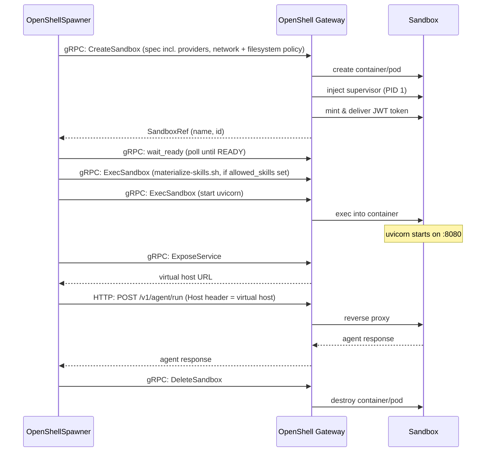

# OpenShell Integration for Cloud Agents

`spawn: ephemeral` steps run inside an OpenShell sandbox. `OpenShellSpawner` (`src/cloud_agents/spawner/openshell_spawner.py`) is the client that talks to an OpenShell gateway to create, drive, and tear down that sandbox. This doc covers the protocol between `OpenShellSpawner` and the gateway, and how to configure the client for the two auth setups in real use: **without OIDC** (dev) and **with OIDC** (prod).


```mermaid
graph TD
    WR["Cloud Agents<br/><i>OpenShellSpawner (gRPC client)</i>"]
    GW["OpenShell Gateway"]
    SB["Sandbox<br/><i>Supervisor + agent runtime</i>"]
    LLM["LLM Provider"]
    MCP["MCP Servers"]

    WR -- "gRPC: Create / Exec / Expose /<br/>ListSandboxes / Delete<br/>+ Provider API" --> GW
    GW -- "spawn + inject supervisor + JWT" --> SB
    WR -- "HTTP (via gateway proxy)<br/>POST /v1/agent/run" --> SB
    SB -- "HTTPS (egress policy)" --> LLM
    SB -- "MCP (policy filtered)" --> MCP

    style GW fill:#1c2128,stroke:#a371f7
    style SB fill:#161b22,stroke:#238636
```

## How Cloud Agents Talks to OpenShell

### Sandbox Lifecycle


```mermaid
sequenceDiagram
    participant WR as OpenShellSpawner
    participant GW as OpenShell Gateway
    participant SB as Sandbox

    WR->>GW: gRPC: CreateSandbox (spec incl. providers, network + filesystem policy)
    GW->>SB: create container/pod
    GW->>SB: inject supervisor (PID 1)
    GW->>SB: mint & deliver JWT token
    GW-->>WR: SandboxRef (name, id)
    WR->>GW: gRPC: wait_ready (poll until READY)

    WR->>GW: gRPC: ExecSandbox (materialize-skills.sh, if allowed_skills set)
    WR->>GW: gRPC: ExecSandbox (start uvicorn)
    GW->>SB: exec into container
    Note over SB: uvicorn starts on :8080

    WR->>GW: gRPC: ExposeService
    GW-->>WR: virtual host URL

    WR->>GW: HTTP: POST /v1/agent/run (Host header = virtual host)
    GW->>SB: reverse proxy
    SB-->>GW: agent response
    GW-->>WR: agent response

    WR->>GW: gRPC: DeleteSandbox
    GW->>SB: destroy container/pod
```

`OpenShellSpawner`'s entire lifecycle -- create, exec, expose, query, destroy -- is fully gateway-mediated gRPC; it never talks to Podman/Kubernetes directly. The gateway manages the container/pod lifecycle, injects a supervisor binary as PID 1 (Landlock + seccomp + network namespace enforcement), and mints a per-sandbox JWT for supervisor-to-gateway authentication.

The sandbox image's CMD is passed to the supervisor as `OPENSHELL_SANDBOX_COMMAND`. Since the spawner starts the actual HTTP server itself via a later `ExecSandbox` call, the image CMD needs to be a keep-alive process (e.g. `sleep infinity`), not the application server.

### Credential Injection

Before creating the sandbox, the spawner injects LLM credentials via the gateway's Provider API, in four gRPC/HTTP steps:

1. **Resolve a real vendor type** (`_resolve_inference_provider_type()`): `LIGHTSPEED_PROVIDER`'s value (e.g. `openai`, `vertex`, `bedrock`) is mapped to one of the gateway's own recognized inference vendor types (`openai`, `anthropic`, `nvidia`, `deepinfra`, `google-vertex-ai`, `aws-bedrock`). An unmapped value fails the spawn immediately, before any gRPC call.
2. **Ensure a provider profile exists** (`_ensure_provider_profile()`): the gateway ships built-in credential-injection/network-egress profiles for most vendor types, but not `openai` or `anthropic` -- without a profile, credential-env-var injection and network policy for that provider would be silently skipped by the gateway. This step idempotently imports a bundled profile for those two types into the spawner's own workspace.
3. **Create the Provider** (`_create_provider()`) with the credential key-value pair and the resolved vendor type, then attach it via `spec.providers` at sandbox-*create* time.
4. **Register an inference route** (`_set_inference_route()`): the sandbox's supervisor resolves its LLM connection details via `GetInferenceBundle`, which returns nothing for a provider that was never registered as a route.

A failure at any of these four steps fails the spawn immediately -- there is no fallback path that writes the credential to a file inside the sandbox.

```yaml
provider:
  name: openai
  model: gpt-4o
  credentials_secret: OPENAI_API_KEY  # env var name containing the API key
```

### Network Policy

`OpenShellSpawner` derives the sandbox's egress policy from step configuration and sends it as part of `CreateSandbox`'s `spec`:

- **LLM provider egress**: HTTPS to the provider host (e.g. `api.openai.com:443`) when `LIGHTSPEED_PROVIDER` is a known name **and** `LIGHTSPEED_PROVIDER_URL` is not set. For hosts with a bundled `ProviderProfile` (`openai`, `anthropic` -- see Credential Injection above), this endpoint gets the same explicit L7 method/path allowlist as the profile (e.g. `POST /v1/chat/completions`) instead of a bare `access="read-write"`, because the gateway's policy merge unions two endpoints pinning the same host rather than letting the narrower one win -- leaving this sandbox-owned rule at `read-write` would silently widen the profile's allowlist back to everything. Hosts with no bundled profile (`gemini`, `azure`) keep the broad `read-write` preset.
- **Custom provider URL**: egress to `LIGHTSPEED_PROVIDER_URL`'s host only -- mutually exclusive with the rule above, used to route sandboxes through a gateway-internal inference proxy instead of the vendor's public API.
- **MCP server egress**: parses `LIGHTSPEED_MCP_SERVERS` JSON and allows egress to each server's host.

No manual network policy YAML is required from workflow authors.

**Known limitation (issue #263):** `step_runner.py` forwards `OTEL_EXPORTER_OTLP_ENDPOINT` into the sandbox's `env_vars` when set on the runner, so the sandbox's own OTEL-aware process knows where to export spans. This env forwarding does **not** add an egress rule for the collector host -- none of the three rules above cover it. Unless the collector happens to be reachable via an already-allowed host (or the sandbox's network policy is otherwise permissive), Landlock will block the export traffic even though the env var is set. The sandbox image's own tracer currently always uses the gRPC exporter regardless of `OTEL_EXPORTER_OTLP_PROTOCOL`, so `step_runner.py` only forwards that variable when it's `grpc` -- an `http/protobuf` runner config is left unforwarded (with a warning logged) rather than silently forwarded and ignored, until the sandbox image itself (a separate repo, `lightspeed-agentic-sandbox`) adds protocol-aware exporter selection.

### Skills Access

Skills are baked into the sandbox image under `/skills/<name>/...`, and which of those a step's agent may read is scoped by `allowed_skills` (part of the `ExecSandbox` call for `materialize-skills.sh` in the lifecycle above). For exactly how `OpenShellSpawner` enforces that against the gateway (Landlock grant + `materialize-skills.sh`), and how skill scoping compares across `spawn: none`/`local`/`ephemeral`, see [tool-registry-architecture.md](tool-registry-architecture.md#skill-enforcement-for-spawn-ephemeral).

## Configuring OpenShellSpawner

| Env Var | Default | Description |
|---|---|---|
| `WORKFLOW_SPAWNER` | *(empty)* | Must be `openshell` to enable `OpenShellSpawner`; any other non-empty value fails startup |
| `OPENSHELL_GATEWAY_URL` | `localhost:17670` | Gateway gRPC endpoint (no `http://` prefix) |
| `OPENSHELL_WORKSPACE` | `default` | OpenShell workspace name |
| `OPENSHELL_HTTP_ENDPOINT` | *(from gateway)* | Override HTTP proxy endpoint when the gateway URL itself isn't routable for HTTP |
| `OPENSHELL_TLS_CA` | | CA certificate path -- required before the spawner will send a bearer token or create a credential Provider |
| `OPENSHELL_TLS_CERT` / `OPENSHELL_TLS_KEY` | | Client certificate/key for mTLS |
| `OPENSHELL_BEARER_TOKEN` | | Static bearer token (requires `OPENSHELL_TLS_CA`) |
| `OPENSHELL_ALLOW_INSECURE_CREDENTIALS` | | Set to `1` to allow `_create_provider()` to send credentials over a plaintext channel -- dev-only escape hatch |

Compute driver (`podman` vs `kubernetes`) is entirely the gateway's own concern -- there is no client-side driver setting; `OpenShellSpawner` talks the same gRPC/HTTP protocol regardless of what the gateway runs sandboxes on.

### Setup 1: Without OIDC (dev)

For a gateway with no auth or a single long-lived static token, and typically no TLS:

```bash
export WORKFLOW_SPAWNER=openshell
export OPENSHELL_GATEWAY_URL=localhost:17670
export OPENSHELL_WORKSPACE=default
export OPENSHELL_ALLOW_INSECURE_CREDENTIALS=1   # required if the gateway has no TLS
```

`_create_provider()` fails closed by default -- it refuses to send LLM credentials over a plaintext channel unless `OPENSHELL_TLS_CA` is set. `OPENSHELL_ALLOW_INSECURE_CREDENTIALS=1` is the explicit opt-in to accept that tradeoff for a plaintext dev gateway; it has no effect once `OPENSHELL_TLS_CA` is set, since TLS is then used regardless of this flag.

If the gateway does require a token but has no OIDC issuer behind it, a static token also works here (still requires TLS, per the table above):

```bash
export OPENSHELL_TLS_CA=/certs/ca.crt
export OPENSHELL_BEARER_TOKEN="$(get-token)"
```

A static token is fine for a short manual session but will expire mid-run on anything long-lived -- see Setup 2 for the durable option.

### Setup 2: With OIDC (prod)

TLS is mandatory here -- `OpenShellSpawner` refuses to build a channel that sends any bearer token, static or provider-sourced, without `OPENSHELL_TLS_CA` configured.

`OpenShellSpawner` itself has no OIDC awareness. Its constructor accepts a `bearer_token_provider` -- a zero-arg callable returning a token string -- as an alternative to the static `bearer_token` string (the two are mutually exclusive; passing both raises `ValueError`). `_create_grpc_channel()` builds a **new gRPC channel on every raw call** (`ExposeService`, `CreateProvider`, `SetInferenceRoute`, ...), not once at construction, and invokes `bearer_token_provider()` each time it needs a token for that channel -- whether the returned string is freshly minted, cached, or refreshed is entirely the provider's problem.

Minting and refreshing the token is the calling application's responsibility, not `cloud_agents`'. `lightspeed-stack`'s `OidcClientCredentialsTokenProvider` (`src/workflow/openshell_oidc_token_provider.py`) is the reference implementation:


```mermaid
sequenceDiagram
    participant CFG as spawner_factory
    participant OSS as OpenShellSpawner
    participant TP as OidcClientCredentialsTokenProvider
    participant IDP as OIDC Issuer (Keycloak)
    participant GW as OpenShell Gateway

    CFG->>TP: construct(issuer, client_id, client_secret, audience)
    CFG->>OSS: construct(bearer_token_provider=TP.get_token)

    Note over OSS: every raw gRPC call builds a fresh channel
    OSS->>TP: get_token()
    alt cached token valid (>30s left)
        TP-->>OSS: cached token
    else expired or no cached token
        TP->>IDP: POST /protocol/openid-connect/token<br/>grant_type=client_credentials
        IDP-->>TP: access_token, expires_in
        TP-->>OSS: fresh token
    end
    OSS->>GW: gRPC call with Bearer token
```

`get_token()`:

- Caches the token and its expiry, re-minting only when the cached token is within 30 seconds of expiry (`_EXPIRY_SAFETY_MARGIN_SECONDS`) -- not on every call, since minting is a real network round-trip and `get_token()` runs before *every* gRPC operation.
- Guards the check-then-fetch with a lock, since `get_token()` is invoked from multiple threads under one spawner instance.
- Derives the token endpoint as `{issuer}/protocol/openid-connect/token` and fails loudly (`OidcTokenFetchError`) on a non-2xx response, a non-JSON body, a missing `access_token`, or a non-numeric `expires_in` -- there's no silent fallback to an empty or stale token. An empty token from the provider is likewise treated as a hard failure by `OpenShellSpawner`, not "no auth configured".

Wiring in `lightspeed-stack`'s `workflow/spawner_factory.py`: presence of `OPENSHELL_OIDC_CLIENT_ID` in config triggers constructing the provider (issuer and client secret are required alongside it); `bearer_token_provider=provider.get_token` is then passed to `cloud_agents`' `build_spawner()` instead of a static `bearer_token`. These `OPENSHELL_OIDC_*` env vars are read by `lightspeed-stack`, not by `cloud_agents` itself:

```bash
export WORKFLOW_SPAWNER=openshell
export OPENSHELL_GATEWAY_URL=gateway.example.com:17670
export OPENSHELL_TLS_CA=/certs/ca.crt
export OPENSHELL_OIDC_ISSUER=https://keycloak.example.com/realms/agents
export OPENSHELL_OIDC_CLIENT_ID=my-service-account
export OPENSHELL_OIDC_CLIENT_SECRET=***
export OPENSHELL_OIDC_AUDIENCE=my-service-account   # optional
```

If the gateway also requires mTLS at the transport layer (independent of the OIDC identity token), add client cert config alongside the above:

```bash
export OPENSHELL_TLS_CERT=/certs/client.crt
export OPENSHELL_TLS_KEY=/certs/client.key
```
