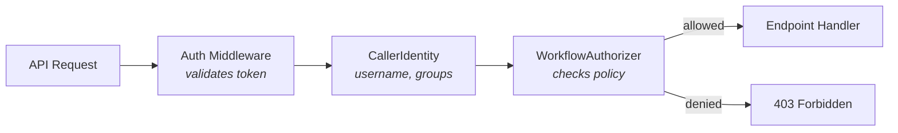

# Workflow Authorization (RBAC)

## Overview

Cloud Agents controls who can trigger, approve, view, and cancel workflows through a pluggable authorization layer. Authorization checks run on every API request after authentication.



## Quick Start

### 1. Enable authorization

Set the environment variable:
```bash
WORKFLOW_AUTHZ=policy
WORKFLOW_AUTHZ_POLICY_PATH=/etc/cloud-agents/policy.yaml
AUTH_REQUIRED=true
```

### 2. Write a policy file

```yaml
# policy.yaml
rules:
  - identity: "team:sre"
    actions: [trigger, approve, cancel, view, view_defs, manage_defs]
    workflows: ["*"]

  - identity: "team:developers"
    actions: [trigger, view]
    workflows: ["diagnose-*"]

  - identity: "user:oncall-bot"
    actions: [trigger]
    workflows: ["alert-triage"]

defaults:
  allow: [view, view_defs]
  deny_unless_matched: [trigger, approve, cancel, manage_defs]
```

### 3. Mount the policy file

**Helm**:
```yaml
# values.yaml
authorization:
  mode: policy
  policyFile: /etc/cloud-agents/policy.yaml
```

**Podman**:
```bash
podman run -v ./policy.yaml:/etc/cloud-agents/policy.yaml:ro \
  -e WORKFLOW_AUTHZ=policy \
  -e WORKFLOW_AUTHZ_POLICY_PATH=/etc/cloud-agents/policy.yaml \
  workflow-runner:latest
```

## How It Works

### Identity

Every authenticated request carries a `CallerIdentity`:

| Auth mode | Username | Groups | Example |
|-----------|----------|--------|---------|
| K8s ServiceAccount token | `system:serviceaccount:{ns}:{name}` | From TokenReview | `system:serviceaccount:prod:sre-bot` |
| Shared secret (Bearer) | `anonymous` | `[]` | All callers indistinguishable |

The identity is extracted by the auth middleware and attached to the request. When authorization is enabled (`WORKFLOW_AUTHZ != none`), a missing identity is a hard 401 error — the system never silently falls back to anonymous.

### Actions

| Action | Endpoints | Description |
|--------|-----------|-------------|
| `trigger` | `POST /v1/workflows/run` | Start a workflow |
| `approve` | `POST /v1/workflows/{id}/approve` | Approve or deny a step |
| `view` | `GET /v1/workflows/{id}`, `GET /{id}/events` | View workflow status |
| `cancel` | `POST /v1/workflows/{id}/cancel` | Cancel a workflow |
| `view_defs` | `GET /v1/workflows/definitions`, `GET /definitions/{name}` | List/read definitions |
| `manage_defs` | `POST /v1/workflows/definitions` | Create/update definitions |

### Authorization Context

When a workflow is triggered, the system captures an immutable authorization context:

```python
WorkflowAuthzContext(
    owner_username="system:serviceaccount:prod:sre-bot",
    owner_groups=["system:serviceaccounts", "team:sre"],
    workflow_name="diagnose-prod",
    namespace="prod",  # parsed from SA username
)
```

This context is stored in Temporal workflow state and loaded for every later operation (approve, view, cancel). This enables owner-scoped rules — for example, a policy that only allows the workflow owner to cancel it.

### Approver Identity

When a user approves or denies a step, their identity is recorded in the workflow state:

```json
{
  "status": "completed",
  "output": {
    "approved": true,
    "approver_username": "system:serviceaccount:prod:sre-lead",
    "approver_uid": "abc-123"
  }
}
```

This is queryable via `GET /v1/workflows/{id}` and also emitted as an audit event.

## Policy Rules

### Identity matching

| Pattern | Matches |
|---------|---------|
| `user:admin` | Caller with username `admin` |
| `team:sre` | Caller with `sre` or `team:sre` in groups |
| `sa:prod:sre-bot` | Caller with username `system:serviceaccount:prod:sre-bot` |
| `anonymous` | Caller with username `anonymous` (shared secret mode) |

### Workflow matching

Rules can scope to specific workflows using glob patterns:

```yaml
workflows: ["diagnose-*"]     # matches diagnose-prod, diagnose-staging
workflows: ["*"]               # matches everything
workflows: ["alert-triage"]    # exact match only
```

### Owner-scoped rules

Rules can require that the caller owns the workflow:

```yaml
- identity: "team:developers"
  actions: [cancel]
  workflows: ["*"]
  conditions:
    require_owner: true    # can only cancel own workflows
```

### Defaults

```yaml
defaults:
  allow: [view, view_defs]                           # anyone authenticated can view
  deny_unless_matched: [trigger, approve, cancel, manage_defs]  # everything else needs a rule
```

Actions in `allow` are permitted for any authenticated caller. Actions in `deny_unless_matched` require an explicit rule match.

## Authorization Backends

| Backend | Config | Use case |
|---------|--------|----------|
| `none` (default) | `WORKFLOW_AUTHZ=none` | No authorization — all authenticated callers can do everything. Backward compatible. |
| `policy` | `WORKFLOW_AUTHZ=policy` | YAML policy file — works on both K8s and Podman. |
| `k8s-sar` | *(deferred)* | K8s SubjectAccessReview — delegates to K8s RBAC. Needs resource model design. |

### Shared secret limitation

In shared secret auth mode, all callers share the same token and are identified as `anonymous`. Policy rules still apply (you can restrict what `anonymous` can do), but this is **deployment-level authorization, not per-user RBAC**. For real per-user access control, use K8s ServiceAccount tokens.

## Not Yet Implemented

- **Risk-level scoped approval** — the design includes `conditions.risk_levels` in policy rules (e.g., a user can only approve low-risk steps). This requires the authorization check to know the pending step's `risk_level`, which means querying workflow state during approval authorization. Deferred — the model supports it but the runtime doesn't query step-level risk during authorization yet.
- **K8s SubjectAccessReview backend** — delegates authorization to the K8s API server. Deferred pending resource model design (how workflow actions map to K8s verbs/resources).

## Fail-Closed Behavior

- `WORKFLOW_AUTHZ=policy` but no authenticated identity → **401** (not silent fallback to anonymous)
- Authz context lookup fails for approve/view/cancel → **503** (not silent degradation to partial context)
- No matching policy rule → **403** (deny by default for non-`allow` actions)
