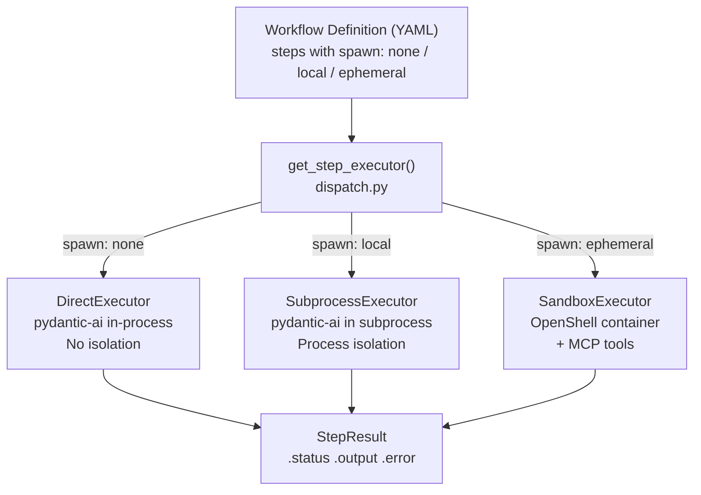
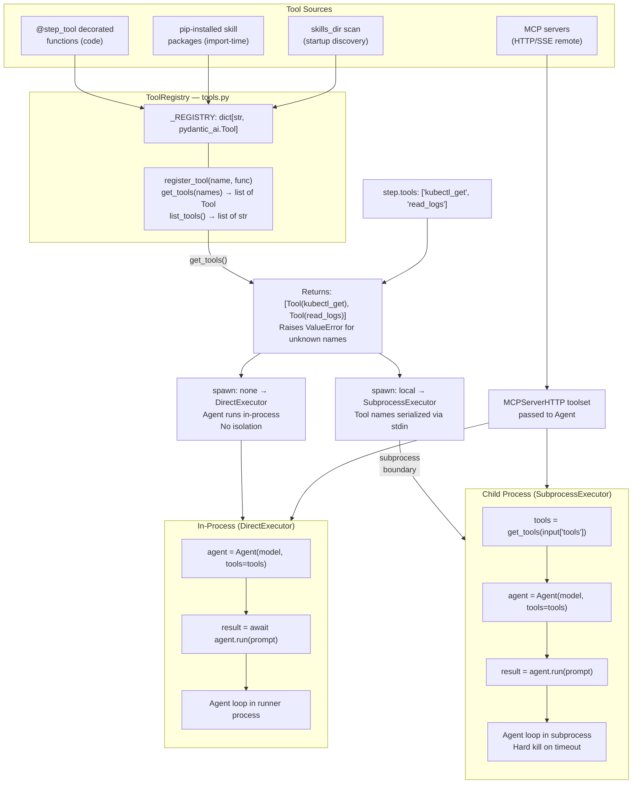
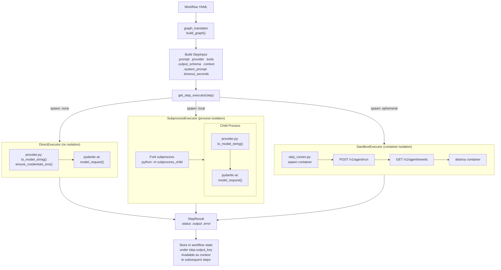
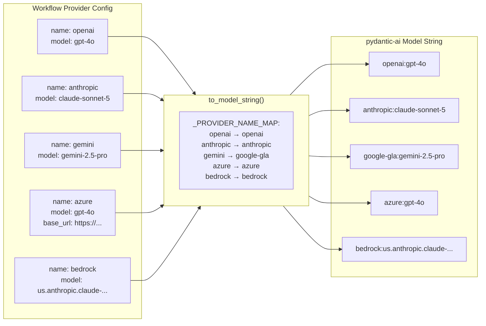
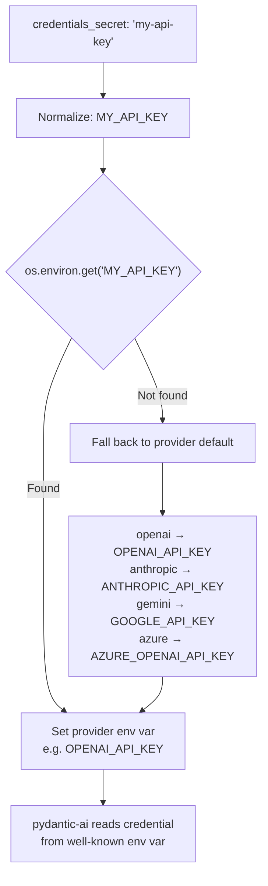
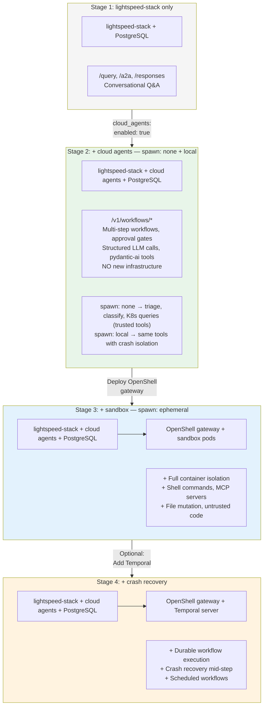

# Tool Registry & Spawn Mode Architecture

> **Note:** Diagrams marked *(Planned)* describe the target architecture from issue #131.
> Items marked *(planned)* in the comparison table are not yet implemented.

## Spawn Mode Dispatch

## Tool Systems by Spawn Mode

| | spawn: none | spawn: local | spawn: ephemeral |
|---|---|---|---|
| **Isolation** | None (in-process) | Process boundary (subprocess) | Container boundary (SecurityContext, NetworkPolicy) |
| **Tool support** | `@step_tool` registered functions | `@step_tool` registered functions | MCP + Shell + Filesystem + Skills |
| **MCP servers** | Remote (HTTP/SSE) | Remote (HTTP/SSE) | Local + remote (inside container) |
| **Skills** | pip packages or skills_dir | pip packages or skills_dir | OCI image via init container |
| **Tool source** | ToolRegistry + MCP + skills | ToolRegistry + MCP + skills | Sandbox image + MCP servers |
| **Agent loop** | Single call; `Agent.run` if tools | Single call; `Agent.run` if tools | Yes (agent SDK in container) |
| **LLM transport** | pydantic-ai `model_request` or `Agent.run` | pydantic-ai `model_request` or `Agent.run` (in subprocess) | Agent SDK in sandbox |
| **Timeout enforcement** | pydantic-ai `model_settings.timeout` | Hard kill (`proc.kill()`) | Container terminate |
| **Providers** | All (via pydantic-ai) | All (via pydantic-ai) | Configured in sandbox env vars |
| **Infrastructure needed** | Nothing (just PostgreSQL) | Nothing (just PostgreSQL) | OpenShell gateway + sandbox image |
| **Best for** | Trusted tools, low latency | Semi-trusted tools, crash safety | Untrusted code, shell access |

## Tool Registry Architecture (spawn: none + local)

## Data Flow: Step Execution Across Spawn Modes

## Provider Mapping (provider.py — shared by all modes)

## Credential Resolution

## Growth Path (Issue #125 — Embedded Mode)

