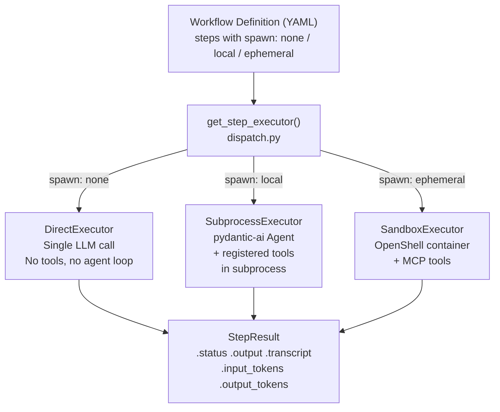
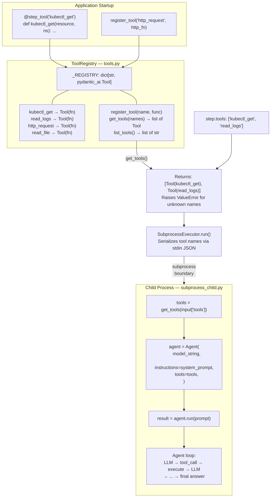
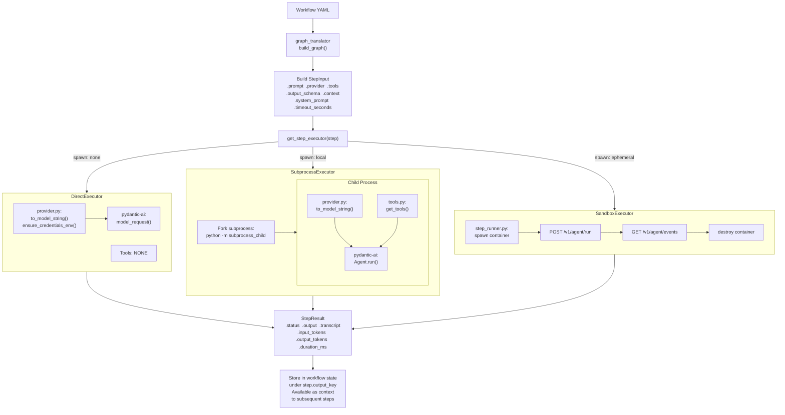
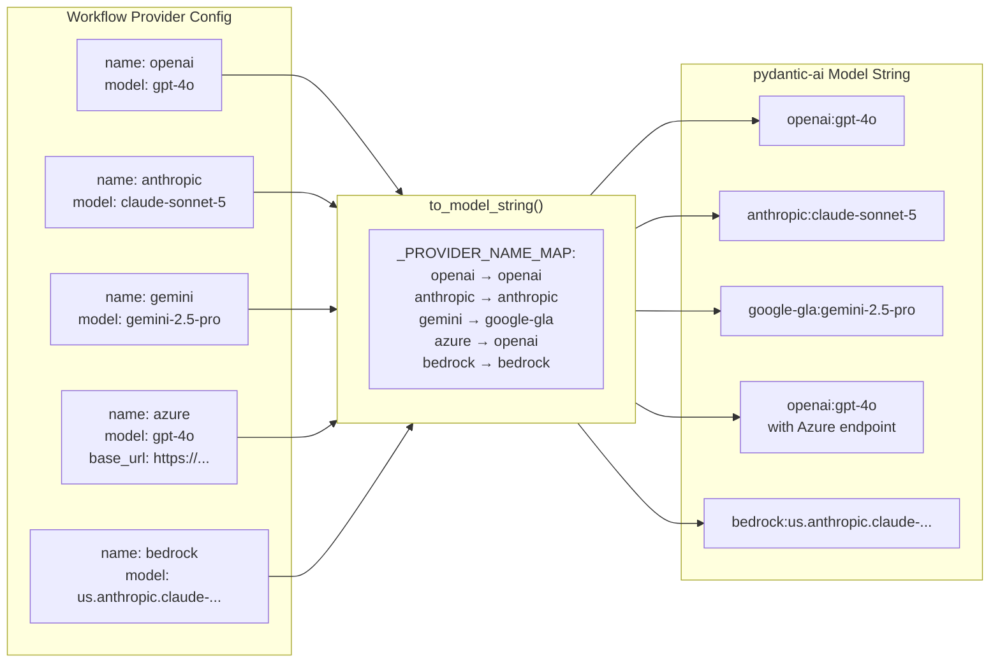
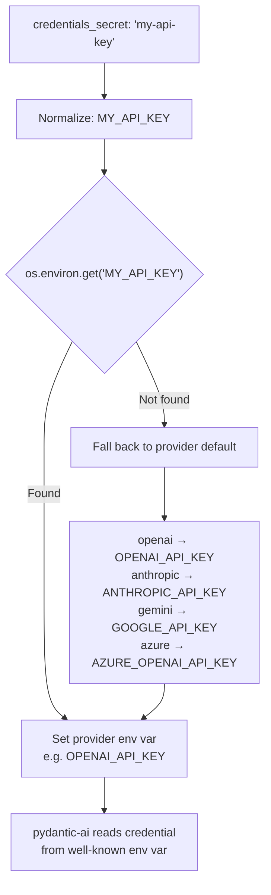
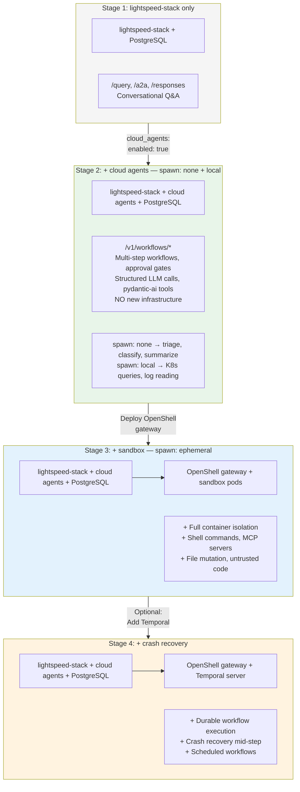

# Tool Registry & Spawn Mode Architecture

## Spawn Mode Dispatch

## Tool Systems by Spawn Mode

| | spawn: none | spawn: local | spawn: ephemeral |
|---|---|---|---|
| **Tool support** | None | pydantic-ai `@tool` functions | MCP + Shell + Filesystem + Skills |
| **Tool source** | N/A | ToolRegistry (in-process) | Sandbox image + MCP servers |
| **Tool isolation** | N/A | Process boundary (subprocess) | Container boundary (SecurityContext, NetworkPolicy) |
| **Agent loop** | No (single call) | Yes (`Agent.run`) | Yes (agent SDK in container) |
| **LLM transport** | pydantic-ai `model_request` | pydantic-ai `Agent.run` | Agent SDK in sandbox |
| **Providers** | All (via pydantic-ai) | All (via pydantic-ai) | Configured in sandbox env vars |
| **Infrastructure needed** | Nothing (just PostgreSQL) | Nothing (just PostgreSQL) | OpenShell gateway + sandbox image |

## Tool Registry Architecture (spawn: local)

## Data Flow: Step Execution Across Spawn Modes

## Provider Mapping (provider.py — shared by all modes)

## Credential Resolution

## Growth Path (Issue #125 — Embedded Mode)

